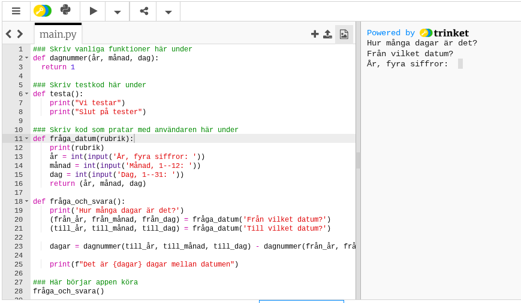

# Hur många dagar fyller du? ⭐⭐

**Har du fyllt 5000 dagar? Vilket datum fyller eller fyllde du 5555 dagar?**

**Uppgift:** Gör en app som räknar ut hur många dagar det är mellan två datum. Använd den för att räkna ut hur många **dagar** du fyller idag!

**Idé:** vi låter appen räkna ut hur många dagar det har gått sen ett visst startdatum, t.ex. 1 januari 2000. Den dagen kallar vi dag nummer 1.
Hur kan du använda den informationen för att räkna ut hur många dagar du fyller idag?


## Innehåll
[**Steg 1:** Prata med användaren](#steg-1-prata-med-användaren)
&bull; [**Steg 2:** Förbered test](#steg-2-förbered-test)
&bull; [**Steg 3:** Testa januari](#steg-3-testa-januari)
&ndash; [Testa februari också](#testa-februari-också)
&bull; [**Steg 4:** Hantera olika år](#steg-4-hantera-olika-år)
&bull; [**Steg 5:** Testa användarupplevelsen](#steg-5-testa-användarupplevelsen)
&bull; [**Steg 6:** EXTRAUPPGIFT: Men skottåren då?](#steg-6-extrauppgift-men-skottåren-då)
&ndash; [Räkna rätt på antalet dagar](#räkna-rätt-på-antalet-dagar)
&ndash; [Nästan klara](#nästan-klara)
&ndash; [Testa en förenkling](#testa-en-förenkling)
&bull; **[Uppgifter](#uppgifter)**

## STEG 1: Prata med användaren


Vi börjar med hur det ska se ut när vi kör appen.
1. Appen ska fråga efter ett startdatum, alltså år, månad, dag. Det kan t.ex. vara användarens födelsedatum
1. Sen ska den fråga efter ett slutdatum, alltså år, månad, dag. Det kan t.ex. vara dagens datum
1. Appen ska skriva `Det är 5432 dagar mellan datumen` (t.ex.) och sen avsluta


✏️ Mata in den här koden i ett nytt Pythonprojekt i trinket.io. Det behöver vara Python 3: https://trinket.io/python3
Om du inte kör Python 3 kommer trinket att klaga på svenska tecken i variablerna, t.ex. `år`. Det går också bra att använda Google Colab.

**main.py**
```python
### Skriv vanliga funktioner här under
def dagnummer(år, månad, dag):
  return 1
  
### Skriv testkod här under
def testa():
    print("Vi testar")
    print("Slut på tester")
  
### Skriv kod som pratar med användaren här under
def fråga_datum(rubrik):
    print(rubrik)
    år = int(input('År, fyra siffror: '))
    månad = int(input('Månad, 1--12: '))
    dag = int(input('Dag, 1--31: '))
    return (år, månad, dag)

def fråga_och_svara():
    print('Hur många dagar är det?')
    (från_år, från_månad, från_dag) = fråga_datum('Från vilket datum?')
    (till_år, till_månad, till_dag) = fråga_datum('Till vilket datum?')
  
    dagar = dagnummer(till_år, till_månad, till_dag) - dagnummer(från_år, från_månad, från_dag)
  
    print(f"Det är {dagar} dagar mellan datumen")

### Här börjar appen köra
fråga_och_svara()
```

✏️ Kör koden med den stora triangelknappen kör i trinket. Mata in dina svar i terminalfönstret till höger.
>Du kan avbryta appen med tangentkombinationen `ctrl` + `C`.

🤔 Vad tror du att resultatet kommer att bli?

## STEG 2: Förbered test

OK, nu har vi en idé hur det kan se ut. Nu behövs det kod för att räkna dagar. 
Funktionen `dagnummer` är ett skelett som behöver fyllas i.

Det finns flera sätt att göra det på. Vi gör det i små steg genom att testa oss fram.

När man skriver en app kan man testa den på olika sätt. 
- Ett sätt är att **mata in** olika värden i terminalfönstret varje gång och kolla att det blir rätt.
- Ibland är det lättare och snabbare att skriva **testkod som datorn kör åt oss**. Det ska vi pröva nu. Testkoden är vårt eget facit, vad vi förväntar oss ska hända. Det är också ett bra sätt att redovisa för andra hur vi tänkte.

✏️ Ändra appen så att det längst ner blir så här. Du kan stänga av frågorna till användaren och istället anropa funktionen `testa`. Då slipper du mata in olika datum hela tiden när du testar.

```
# Skriv vanliga funktioner här under

def dagnummer(år, månad, dag):
    return 1

# Skriv testkod här under

def testa():
    print("Vi testar")
    print("Slut på tester")

# Skriv kod som pratar med användaren här under

def fråga_datum(rubrik):
    print(rubrik)
    år = int(input('År, fyra siffror: '))
    månad = int(input('Månad, 1--12: '))
    dag = int(input('Dag, 1--31: '))
    return (år, månad, dag)


def fråga_och_svara():
    print('Hur många dagar är det?')
    (från_år, från_månad, från_dag) = fråga_datum('Från vilket datum?')
    (till_år, till_månad, till_dag) = fråga_datum('Till vilket datum?')

    dagar = dagnummer(till_år, till_månad, till_dag) - dagnummer(från_år, från_månad, från_dag)

    print(f"Det är {dagar} dagar mellan datumen")


# Här börjar appen köra

testa() # ändra 📆
# fråga_och_svara() # ändra 📆
```

✏️ Vad händer om du kör appen nu? Vad står det i terminalfönstret? Verkar det rimligt?

Så här ser det ut när jag kör:


## STEG 3: Testa januari
Vi vill att funktionen `dagnummer` ska ge oss antalet dagar från den 1 januari 2000, som vi kan kalla dag 1.

✏️ Lägg till ett test i funktionen `testa()`. Det ska kolla om den 1 januari 2000 är dag 1.
```python
### Skriv testkod här under
def testa():
    print("Vi testar")
    d = dagnummer(2000, 1, 1) #nyrad 📆
    if d != 1: print(f"Dagnummer 1 blev fel: {d}") #nyrad 📆
    print("Slut på tester")
```

🤔 Vad tror du resultatet blir? Kör koden i trinket.io. Blev det som du tänkte dig?

✏️ Lägg till ett testfall längst ner i `testa()`. Det ska kolla om den 31 januari 2000 är dag 31.
Så här ser hela koden ut just nu:

```python
# Skriv vanliga funktioner här under
def dagnummer(år, månad, dag):
    return 1

# Skriv testkod här under
def testa():
    print("Vi testar")
    d = dagnummer(2000, 1, 1)
    if d != 1: print(f"Dagnummer 1 blev fel: {d}")
    d = dagnummer(2000, 1, 31)
    if d != 31: print(f"Dagnummer 31 blev fel: {d}")
    print("Slut på tester")

# Skriv kod som pratar med användaren här under
def fråga_datum(rubrik):
    print(rubrik)
    år = int(input('År, fyra siffror: '))
    månad = int(input('Månad, 1--12: '))
    dag = int(input('Dag, 1--31: '))
    return (år, månad, dag)


def fråga_och_svara():
    print('Hur många dagar är det?')
    (från_år, från_månad, från_dag) = fråga_datum('Från vilket datum?')
    (till_år, till_månad, till_dag) = fråga_datum('Till vilket datum?')

    dagar = dagnummer(till_år, till_månad, till_dag) - dagnummer(från_år, från_månad, från_dag)

    print(f"Det är {dagar} dagar mellan datumen")

# Här börjar appen köra
testa()
# fråga_och_svara()
```

✏️ Vad tror du resultatet blir nu? Kör koden i trinket.io. Vad står det i terminalfönstret? Blev det som du tänkte dig?

Så här ser det ut när jag kör:


Kan du hitta på ett sätt att ändra funktionen `dagnummer` så att våra två tester fungerar? 
`dagnummer(2000, 1, 1)` ska ge svaret 1 och `dagnummer(2000, 1, 31)` ska ge svaret 31.[^1]

## Testa februari också

✏️ Lägg till ett nytt testfall längst ner i `testa()`. Vi vill testa att den 28 februari 2000 är dag 59, alltså 31 + 28.
De nya raderna är markerade med `#nyrad` men det behöver du inte skriva in.

**main.py**
```python
# Skriv testkod här under
def testa():
    print("Vi testar")
    d = dagnummer(2000, 1, 1)
    if d != 1: print(f"Dagnummer 1 blev fel: {d}")
    d = dagnummer(2000, 1, 31)
    if d != 31: print(f"Dagnummer 31 blev fel: {d}")
    d = dagnummer(2000, 2, 28) # nyrad 📆 
    if d != 59: print(f"Dagnummer 59 blev fel: {d}") # nyrad 📆 
    print("Slut på tester")
```

För att komma vidare behöver vi en funktion som kan räkna ut vilken dag på året det är.
Här är början till en sådan funktion. 

✏️ Skriv in funktionen högst upp. **Glöm inte att ändra så att funktionen `dagnummer` anropar vår nya funktion.**

**main.py**
```python
### Skriv funktioner här under
# Hur många dagar in på året är vi? # nytt 📆 
def dagnummer_på_året(år, månad, dag): # år med fyra siffror, månad 1 till 12, dag 1 till 31 # nytt 📆 
    dagnr = dag # nytt 📆 
    if månad > 1: dagnr += 31 # plussa på antalet dagar i januari # nytt 📆 
    if månad > 2: dagnr += 28 # vi struntar i skottår så länge # nytt 📆 
    if månad > 3: dagnr += 31 # antalet dagar i mars # nytt 📆 
    # ATT FIXA: ta hand om resten av månaderna med "if" # nytt 📆 
    return dagnr # nytt 📆 

def dagnummer(år, månad, dag):
    return dagnummer_på_året(år, månad, dag) # ändrad 📆 
```

✏️ Tror du att testet för februari (dag 59) fungerar nu? Testkör. 

✏️ Lägg nu till fler tester. **Åtminstone behöver du ett test för nyårsafton.** Vi struntar i skottår så länge. Därför är nyårsafton dag 365.

**main.py**
```
# Skriv testkod här under
def testa():
    print("Vi testar")
    d = dagnummer(2000, 1, 1)
    if d != 1: print(f"Dagnummer 1 blev fel: {d}")
    d = dagnummer(2000, 1, 31)  
    if d != 31: print(f"Dagnummer 31 blev fel: {d}")
    d = dagnummer(2000, 2, 28) 
    if d != 59: print(f"Dagnummer 59 blev fel: {d}")
    d = dagnummer(2000, 12, 31) # nytt 📆 
    if d != 365: print(f"Dagnummer 365 blev fel: {d}") # nytt 📆
    print("Slut på tester")
```

🤔 Vad tror du kommer att hända? Testkör. Blev det som du tänkt?

✏️ Skriv klart koden för `dagnummer_på_året` genom att lägga till regler för `månad > 4` och så vidare till `månad > 11`. Testkör din kod ofta och lägg till fler testfall i funktionen `testa()`. Här är ett nytt test för 1 mars.

**main.py, funktionen testa()**
```python
# Skriv testkod här under
def testa():
    print("Vi testar")
    d = dagnummer(2000, 1, 1)
    if d != 1: print(f"Dagnummer 1 blev fel: {d}")
    d = dagnummer(2000, 1, 31)
    if d != 31: print(f"Dagnummer 31 blev fel: {d}")
    d = dagnummer(2000, 2, 28)
    if d != 59: print(f"Dagnummer 59 blev fel: {d}")
    d = dagnummer(2000, 3, 1) # nytt 📆
    if d != 60: print(f"Dagnummer 60 blev fel: {d}") # nytt 📆
    d = dagnummer(2000, 12, 31)
    if d != 365: print(f"Dagnummer 365 blev fel: {d}")
    print("Slut på tester")
```

Nu ska funktionen `dagnummer_på_året` fungera. Alla testfallen ska ge rätt svar.
- Om ett testfall inte ger rätt svar kan testfallet eller koden vara fel, eller i värsta fall båda 🤔

<details>
    <summary>📝 Så här kan all koden se ut nu</summary>

```python
### Skriv funktioner här under
# Hur många dagar in på året är vi?
def dagnummer_på_året(år, månad, dag): # år med fyra siffror, månad 1 till 12, dag 1 till 31
    dagnr = dag
    if månad > 1: dagnr += 31 # plussa på antalet dagar i januari 
    if månad > 2: dagnr += 28 # vi struntar i skottår så länge
    if månad > 3: dagnr += 31 # antalet dagar i mars
    if månad > 4: dagnr += 30 # april
    if månad > 5: dagnr += 31 # maj
    if månad > 6: dagnr += 30 # juni
    if månad > 7: dagnr += 31 # juli
    if månad > 8: dagnr += 31 # augusti
    if månad > 9: dagnr += 30 # september
    if månad > 10: dagnr += 31 # oktober
    if månad > 11: dagnr += 30 # november
    return dagnr

def dagnummer(år, månad, dag):
    return dagnummer_på_året(år, månad, dag)

# Skriv testkod här under
def testa():
    print("Vi testar")

    d = dagnummer(2000, 1, 1)
    if d != 1: print(f"Dagnummer 1 blev fel: {d}")
    d = dagnummer(2000, 1, 31)
    if d != 31: print(f"Dagnummer 31 blev fel: {d}")
    d = dagnummer(2000, 2, 28)
    if d != 59: print(f"Dagnummer 59 blev fel: {d}")
    d = dagnummer(2000, 3, 1) 
    if d != 60: print(f"Dagnummer 60 blev fel: {d}") 
    d = dagnummer(2000, 12, 31)
    if d != 365: print(f"Dagnummer 365 blev fel: {d}")

    print("Slut på tester")

# Skriv kod som pratar med användaren här under


def fråga_datum(rubrik):
    print(rubrik)
    år = int(input('År, fyra siffror: '))
    månad = int(input('Månad, 1--12: '))
    dag = int(input('Dag, 1--31: '))
    return (år, månad, dag)


def fråga_och_svara():
    print('Hur många dagar är det?')
    (från_år, från_månad, från_dag) = fråga_datum('Från vilket datum?')
    (till_år, till_månad, till_dag) = fråga_datum('Till vilket datum?')

    dagar = dagnummer(till_år, till_månad, till_dag) - dagnummer(från_år, från_månad, från_dag)

    print(f"Det är {dagar} dagar mellan datumen")


# Här börjar appen köra
testa()
# fråga_och_svara()
```

</details>

## STEG 4: Hantera olika år

Nu ska vi göra klart funktionen `dagnummer` så att den klarar olika år. Just nu struntar den helt i vilket år det är.
>Funktionen dagnummer ska ge oss antalet dagar räknat från den 1 januari 2000, som är dag 1.

✏️ Kan du skriva ett enkelt testfall som visar att funktionen `dagnummer` är trasig?
>Ett sätt är att lägga till 1 januari 2001:

```python
# Skriv testkod här under
def testa():
    print("Vi testar")

    d = dagnummer(2000, 1, 1)
    if d != 1: print(f"Dagnummer 1 blev fel: {d}")
    d = dagnummer(2000, 1, 31)
    if d != 31: print(f"Dagnummer 31 blev fel: {d}")
    d = dagnummer(2000, 2, 28)
    if d != 59: print(f"Dagnummer 59 blev fel: {d}")
    d = dagnummer(2000, 3, 1) 
    if d != 60: print(f"Dagnummer 60 blev fel: {d}") 
    d = dagnummer(2000, 12, 31)
    if d != 365: print(f"Dagnummer 365 blev fel: {d}")
    d = dagnummer(2001, 1, 1) # nytt 📆
    if d != 366: print(f"Dagnummer 366 blev fel: {d}") # nytt 📆

    print("Slut på tester")
```

✏️ Vad tror du svaret blir? Testkör.

Funktionen `dagnummer` räknar inte med att det har gått 365 dagar sedan den 1 januari 2000.
Det kan vi lösa genom att lägga till de dagarna i `dagnummer`.

Exempel:
* Om året är 2001, ska vi lägga till 365 dagar
* Om året är 2002, ska vi lägga till 365 * 2 dagar

**main.py**
```python
def dagnummer(år, månad, dag):
    return dagnummer_på_året(år, månad, dag) + 365 * (år - 2000) # ändrat 📆
```

✏️ Innan la vi till testet för dagnummer(2001, 1, 1). Tror du det fungerar? Testkör.

## STEG 5: Testa användarupplevelsen

✏️ Ändra så att vi kan testa appen som vanlig användare nu.

**main.py**
```
### Här börjar appen köra
# testa()
fråga_och_svara()
```

<details>
    <summary>📝 Så här kan all koden se ut nu</summary>

```python
### Skriv funktioner här under
# Hur många dagar in på året är vi?
def dagnummer_på_året(år, månad, dag): # år med fyra siffror, månad 1 till 12, dag 1 till 31
    dagnr = dag
    if månad > 1: dagnr += 31 # plussa på antalet dagar i januari 
    if månad > 2: dagnr += 28 # vi struntar i skottår så länge
    if månad > 3: dagnr += 31 # antalet dagar i mars
    if månad > 4: dagnr += 30 # april
    if månad > 5: dagnr += 31 # maj
    if månad > 6: dagnr += 30 # juni
    if månad > 7: dagnr += 31 # juli
    if månad > 8: dagnr += 31 # augusti
    if månad > 9: dagnr += 30 # september
    if månad > 10: dagnr += 31 # oktober
    if månad > 11: dagnr += 30 # november
    return dagnr

def dagnummer(år, månad, dag):
    return dagnummer_på_året(år, månad, dag) + 365 * (år - 2000) # ändrat 📆

# Skriv testkod här under
def testa():
    print("Vi testar")

    d = dagnummer(2000, 1, 1)
    if d != 1: print(f"Dagnummer 1 blev fel: {d}")
    d = dagnummer(2000, 1, 31)
    if d != 31: print(f"Dagnummer 31 blev fel: {d}")
    d = dagnummer(2000, 2, 28)
    if d != 59: print(f"Dagnummer 59 blev fel: {d}")
    d = dagnummer(2000, 3, 1) 
    if d != 60: print(f"Dagnummer 60 blev fel: {d}") 
    d = dagnummer(2000, 12, 31)
    if d != 365: print(f"Dagnummer 365 blev fel: {d}")
    d = dagnummer(2001, 1, 1)
    if d != 366: print(f"Dagnummer 366 blev fel: {d}") 

    print("Slut på tester")

# Skriv kod som pratar med användaren här under

def fråga_datum(rubrik):
    print(rubrik)
    år = int(input('År, fyra siffror: '))
    månad = int(input('Månad, 1--12: '))
    dag = int(input('Dag, 1--31: '))
    return (år, månad, dag)

def fråga_och_svara():
    print('Hur många dagar är det?')
    (från_år, från_månad, från_dag) = fråga_datum('Från vilket datum?')
    (till_år, till_månad, till_dag) = fråga_datum('Till vilket datum?')

    dagar = dagnummer(till_år, till_månad, till_dag) - dagnummer(från_år, från_månad, från_dag)

    print(f"Det är {dagar} dagar mellan datumen")

# Här börjar appen köra
# testa() # ändrat 📆
fråga_och_svara() # nytt 📆
```

</details>

✏️ Kan du använda din app för att svara på frågan när du fyller 5555 dagar? Kanske du har någon kompis eller släkt som vill veta hur många dagar hen är?

✏️ Gör steg 6 för att få rätt på skottår eller hoppa direkt till [uppgifterna](#uppgifter) längst ner.

## STEG 6: EXTRAUPPGIFT: Men skottåren då?

Normalt är vart fjärde år skottår. Då har vi en skottdag den 29 februari att räkna med.

Om du har följt beskrivningen så har vi ett par testfall att rätta till.
- Den 28 februari 2000 har dagnummer 59 &ndash; det stämmer fortfarande 🙂
- Den 29 februari 2000 har dagnummer 60
- Den 1 mars 2000 har dagnummer 61
- Den 31 december 2000 har dagnummer 366

✏️ Rätta till eller lägg till testfallen. Vad kommer att hända när du kör? Testkör.

Så här kan testfallen se ut.
```
# Skriv testkod här under
def testa():
    print("Vi testar")

    d = dagnummer(2000, 1, 1)
    if d != 1: print(f"Dagnummer 1 blev fel: {d}")
    d = dagnummer(2000, 1, 31)
    if d != 31: print(f"Dagnummer 31 blev fel: {d}")
    d = dagnummer(2000, 2, 28)
    if d != 59: print(f"Dagnummer 59 blev fel: {d}")
    d = dagnummer(2000, 2, 29) # ändrat 📆
    if d != 60: print(f"Dagnummer 60 blev fel: {d}") # ändrat 📆
    d = dagnummer(2000, 3, 1) # ändrat 📆
    if d != 61: print(f"Dagnummer 61 blev fel: {d}") # ändrat 📆
    d = dagnummer(2000, 12, 31)
    if d != 366: print(f"Dagnummer 366 blev fel: {d}") # ändrat 📆
    d = dagnummer(2001, 1, 1)
    if d != 367: print(f"Dagnummer 367 blev fel: {d}") # ändrat 📆

    print("Slut på tester")
# etc.

# Här börjar appen köra
# testa() # ändrat 📆
fråga_och_svara() # ändrat 📆
```

Koden i `dagnummer_på_året()` behöver ta hänsyn till de 29 dagarna i februari.

Vi kan lägga till en funktion som heter `skottdag(år)` som ger svaret 0 eller 1 beroende på om det är skottår. 
Då kan vi lätt ändra i `dagnummer_på_året` så att februari räknas rätt:

```python3
def dagnummer_på_året(år, månad, dag): # år med fyra siffror, månad 1 till 12, dag 1 till 31
  dagnr = dag
  if månad > 1: dagnr += 31 # plussa på antalet dagar i januari 
  if månad > 2: dagnr += 28 + skottdag(år) #ändrad
  if månad > 3: dagnr += 31 # antalet dagar i mars
```

Du behöver skriva in funktionen `skottdag()` någonstans före `dagnummer_på_året()`.
>Regeln är att år som är jämnt delbara med 4 eller 400 är skottår. År som »bara« är jämna 100-tal räknas inte som skottår, t.ex. år 2100.

Så här kan koden se ut nu:

**main.py:**
```python
### Skriv funktioner här under

def skottdag(år): # 1 om skottår, annars 0 # nytt 📆
    # "%" ger resten vid division och kallas "modulo" eller bara "mod" # nytt 📆
    if år % 400 == 0: return 1 # nytt 📆
    if år % 100 == 0: return 0 # nytt 📆
    if år % 4 == 0: return 1 # nytt 📆
    return 0 # nytt 📆

# Hur många dagar in på året är vi?
def dagnummer_på_året(år, månad, dag): # år med fyra siffror, månad 1 till 12, dag 1 till 31
    dagnr = dag
    if månad > 1: dagnr += 31 # plussa på antalet dagar i januari 
    if månad > 2: dagnr += 28 + skottdag(år) # februari # ändrat 📆
    if månad > 3: dagnr += 31 # antalet dagar i mars
    if månad > 4: dagnr += 30 # april
    if månad > 5: dagnr += 31 # maj
    if månad > 6: dagnr += 30 # juni
    if månad > 7: dagnr += 31 # juli
    if månad > 8: dagnr += 31 # augusti
    if månad > 9: dagnr += 30 # september
    if månad > 10: dagnr += 31 # oktober
    if månad > 11: dagnr += 30 # november
    return dagnr

# etc. som innan
```

✏️ Vilka tester tror du kommer att fungera nu? Testkör!

### Räkna rätt på antalet dagar

I slutet av funktionen `dagnummer` har vi en uträkning som alltid räknar med 365 dagar per år: `365 * (år - 2000)`. Det stämmer inte när vi ska räkna skottår.
Innan vi gör om den uträkningen så flyttar vi den till en egen funktion som vi kallar `dagar_före(år)`.

✏️ Lägg funktionen `dagar_före(år)` någonstans ovanför funktionen `dagnummer()`.
Ändra funktionen `dagnummer` så att den använder `dagar_före`.

Så här kan översta delen av koden se ut nu:
**main.py**
```python
# etc. som innan
    if månad > 10: dagnr += 31 # oktober
    if månad > 11: dagnr += 30 # november
    return dagnr

def dagar_före(år): # flyttad 📆
    return 365 * (år - 2000) # flyttad 📆

def dagnummer(år, månad, dag):
    return dagnummer_på_året(år, månad, dag) + dagar_före(år) # ändrat 📆

# Skriv testkod här under
def testa():
# etc. som innan
```

✏️ Om du testkör ska det fungera likadant bra/dåligt som innan. Vi har bara flyttat ut beräkningen innan vi gör om den.

## Nästan klara!
Nu ska vi göra klart `dagar_före` så att skottåren/skottdagarna räknas rätt.

- `dagar_före(2000)` ska ge svaret 0
- `dagar_före(2001)` ska ge svaret 366
- `dagar_före(2002)` ska ge svaret 366 + 365 = 731

✏️ Du kan lägga till testfall som beskriver detta om du vill. T.ex. så här:

**main.py**

```python
def testa():
  # ... (som innan)
  d = dagar_före(2001)
  if d != 366: print(f"Dagar före 2001 blev fel: {d}") 
```

✏️ Ändra `dagar_före` så här:

**main.py**
```python
def dagar_före(år): # hur många dagar från 1 januari 2000 till 31 december (år - 1)?
    dagar = 0
    for å in range(2000, år): # å får värdena 2000, 2001, ..., år - 1
      dagar += 365 + skottdag(å)
    return dagar
```

<details>
    <summary>📝 Så här kan all koden se ut nu</summary>

```python
### Skriv funktioner här under

def skottdag(år): # 1 om skottår, annars 0
    # "%" ger resten vid division och kallas "modulo" eller bara "mod"
    if år % 400 == 0: return 1
    if år % 100 == 0: return 0
    if år % 4 == 0: return 1
    return 0

# Hur många dagar in på året är vi?
def dagnummer_på_året(år, månad, dag): # år med fyra siffror, månad 1 till 12, dag 1 till 31
    dagnr = dag
    if månad > 1: dagnr += 31 # plussa på antalet dagar i januari 
    if månad > 2: dagnr += 28 + skottdag(år) # februari
    if månad > 3: dagnr += 31 # antalet dagar i mars
    if månad > 4: dagnr += 30 # april
    if månad > 5: dagnr += 31 # maj
    if månad > 6: dagnr += 30 # juni
    if månad > 7: dagnr += 31 # juli
    if månad > 8: dagnr += 31 # augusti
    if månad > 9: dagnr += 30 # september
    if månad > 10: dagnr += 31 # oktober
    if månad > 11: dagnr += 30 # november
    return dagnr

def dagar_före(år): # ändrat 📆
    dagar = 0  # ändrat 📆
    for å in range(2000, år):  # ändrat 📆
        dagar += 365 + skottdag(å)  # ändrat 📆
    return dagar  # ändrat 📆

def dagnummer(år, månad, dag):
    return dagnummer_på_året(år, månad, dag) + dagar_före(år)

# Skriv testkod här under
def testa():
    print("Vi testar")

    d = dagnummer(2000, 1, 1)
    if d != 1: print(f"Dagnummer 1 blev fel: {d}")
    d = dagnummer(2000, 1, 31)
    if d != 31: print(f"Dagnummer 31 blev fel: {d}")
    d = dagnummer(2000, 2, 28)
    if d != 59: print(f"Dagnummer 59 blev fel: {d}")
    d = dagnummer(2000, 2, 29)
    if d != 60: print(f"Dagnummer 60 blev fel: {d}")
    d = dagnummer(2000, 3, 1) 
    if d != 61: print(f"Dagnummer 61 blev fel: {d}")
    d = dagnummer(2000, 12, 31)
    if d != 366: print(f"Dagnummer 366 blev fel: {d}")
    d = dagnummer(2001, 1, 1)
    if d != 367: print(f"Dagnummer 367 blev fel: {d}")

    print("Slut på tester")

# Skriv kod som pratar med användaren här under


def fråga_datum(rubrik):
    print(rubrik)
    år = int(input('År, fyra siffror: '))
    månad = int(input('Månad, 1--12: '))
    dag = int(input('Dag, 1--31: '))
    return (år, månad, dag)


def fråga_och_svara():
    print('Hur många dagar är det?')
    (från_år, från_månad, från_dag) = fråga_datum('Från vilket datum?')
    (till_år, till_månad, till_dag) = fråga_datum('Till vilket datum?')

    dagar = dagnummer(till_år, till_månad, till_dag) - dagnummer(från_år, från_månad, från_dag)

    print(f"Det är {dagar} dagar mellan datumen")


# Här börjar appen köra
# testa()
fråga_och_svara()
```

</details>
  
✏️ Hur många dagar fyller du idag, räknat med skottår?

## Testa en förenkling

Hur bra blir resultatet om vi fuskar lite och gör en mycket enklare `dagar_före(år)` som ofta räknar rätt?

I början hade vi den här varianten:

**main.py**
```python
def dagar_före(år):
    return 365 * (år - 2000)
```

✏️ Hur blir det om vi räknar åren som 365.25 dagar istället, alltså att ungefär vart fjärde år är skottår?

Koden kan då se ut så här. 
>Funktionen `int` avrundar till heltal så att vi alltid får hela dagar.

**main.py**
```python
def dagar_före(år):
    return int(365.25 * (år - 2000)) # ändrad uträkning
```

# Uppgifter
1. När fyller/fyllde du 5000 dagar? Hur många dagar fyller du idag?


2. Utvärdera ert eget arbete!
När ni svarar på detta, tänk på att *ni har tillgång till uppgiften* &ndash; ni behöver alltså inte kunna koden utantill.
- 2A. De här delarna av uppgiften har vi gjort. Vi förstår dem och kan förklara koden för Susanne eller inför klassen.
- 2B. De här delarna av uppgiften har vi gjort *men vi förstår dem inte till 100%*. Ge exempel på något ni inte förstår.

3. Pröva att göra någon ändring eller förbättring. Se uppgift 5 för en idé.
- Beskriv kort vad ändringen är och hur den ska fungera.
- Beskriv hur du fick ändra koden för att göra ändringen. Glöm inte kodexempel.
- Om det inte gick att genomföra, förklara med några meningar vad du försökte och vad som hände. Glöm inte kodexempel.

4. I funktionen `dagnummer_på_året` finns det regler för alla månader utom januari. Varför behövs ingen regel för januari?

5. *(Frivillig extrauppgift)* Ändra så att koden fungerar för datum på 1900-talet också. Räkna ut antalet dagar som en äldre bekant eller släkting fyller och överraska dem med ny kunskap!
- Glöm inte kodexempel och att förklara hur du testade din ändring.

6. *(Frivillig extrauppgift)* Användaren kan mata in datum som inte finns eller som koden inte klarar av. Det kommer inga varningar. Några exempel är 35 maj 2026 eller 31 januari 1910. Lägg in några kontroller så att koden säger till när år, månad eller dag eller fel. Låt sen användaren försöka igen.

[^1]: `return dag` istället för `return 1`
