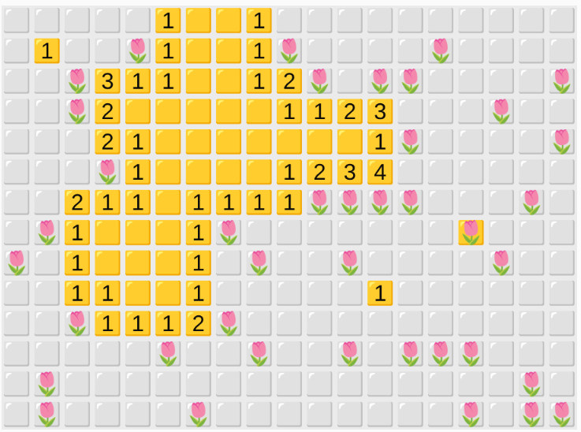
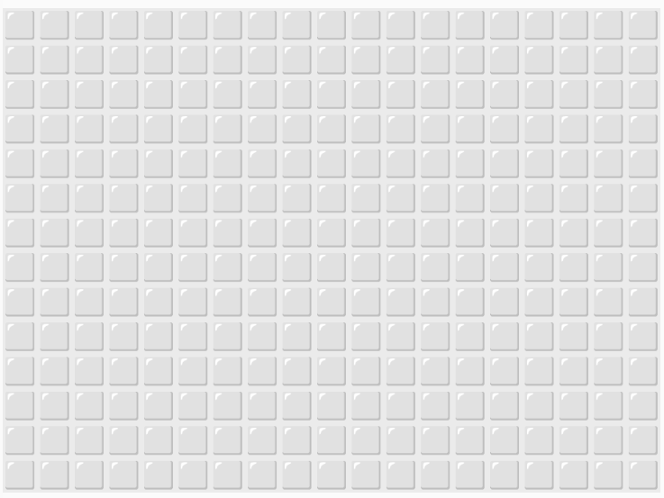
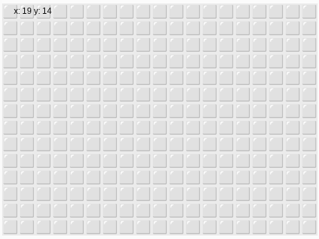
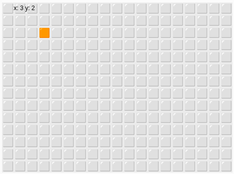
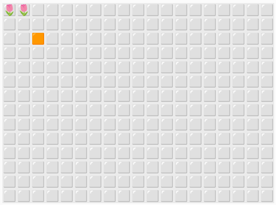
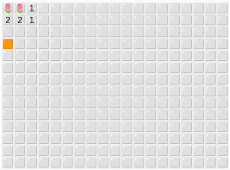

# Flowers ⭐⭐⭐
## En handledning för JavaScript och Processing i editor.p5js.org




## Innehåll
**[Regler](#regler)** [Kontroller](#kontroller)

**[Översikt](#översikt)**

**[Kodning](#kodning)**
  [Rita celler](#rita-celler)
  &bull; [Markera celler](#markera-celler)
  &bull; [Bara celler inom rutnätet ska gå att välja](#bara-celler-inom-rutnätet-ska-gå-att-välja)
  &bull; [Markera vald cell](#markera-vald-cell)
  &bull; [Ändra cellens utseende när vänster musknapp klickas](#ändra-cellens-utseende-när-vänster-musknapp-klickas)
  &bull; [Rita blommor](#rita-blommor)
  &bull; [Förenkla koden](#förenkla-koden)
  &bull; [Växla blommor](#växla-blommor)
  &bull; [Visa antalet blommor runt cellen](#visa-antalet-blommor-runt-cellen)
  &bull; [Slumpa blomplanteringen](#slumpa-blomplanteringen)
  &bull; [Återställa spelet](#återställa-spelet)
  &bull; [Att avtäcka celler](#att-avtäcka-celler)
  &bull; [En lista som sparar celler som ska avtäckas](#en-lista-som-sparar-celler-som-ska-avtäckas)
  &bull; [Lägg till fler celler på listan](#lägg-till-fler-celler-på-listan)
  &bull; [Ta hänsyn till antalet grannblommor när vi avtäcker](#ta-hänsyn-till-antalet-grannblommor-när-vi-avtäcker)
  &bull; [Rita flaggor och frågetecken](#rita-flaggor-och-frågetecken)
  &bull; [Byta cellens status mellan blank, flagga och frågetecken](#byta-cellens-status-mellan-blank-flagga-och-frågetecken)
  &bull; [Hindra att flaggade celler avtäcks](#hindra-att-flaggade-celler-avtäcks)
  &bull; [Celler med frågetecken får avtäckas](#celler-med-frågetecken-får-avtäckas)
  &bull; [Ändra grafiken när vänster musknapp klickar på en flaggad cell](#ändra-grafiken-när-vänster-musknapp-klickar-på-en-flaggad-cell)
  &bull; [Slut på spelet](#slut-på-spelet)
  &bull; [Att vinna spelet](#att-vinna-spelet)
  &bull; [Nytt spel vid nästa klick](#nytt-spel-vid-nästa-klick)
  &bull; [Sluta markera celler när spelet är slut](#sluta-markera-celler-när-spelet-är-slut)
  &bull; [Göm blommorna tills spelet är slut](#göm-blommorna-tills-spelet-är-slut)
  &bull; [Göm antalet blomgrannar för täckta celler](#göm-antalet-blomgrannar-för-täckta-celler)
  &bull; [Hindra att man klickar på en blomma vid första klicket](#hindra-att-man-klickar-på-en-blomma-vid-första-klicket)

**[Uppgifter](#uppgifter)**

**[Källor](#källor)**

## Jobba så här
Bygg spelet bit för bit.
- Gör ett avsnitt i taget.
- Testa ofta.
- Gå vidare först när det fungerar.

Om något var svårt: skriv ner det till redovisningen. 📝
- Samma om du ber om hjälp från generativt 🤖 AI: skriv ner frågan och en sammanfattning av svaret *med dina egna ord* i en mening. Ta med det i redovisningen som en källa. Det påverkar bedömningen och hjälper oss också att förbättra uppgiften.


# Regler
Spelet börjar med ett rutnät av täckta rutor. Under några rutor finns blommor.

Om du klickar på en blomma är spelet slut.

När du vänsterklickar avtäcks en ruta. Om rutan saknar blomgrannar så avtäcks fler rutor automatiskt.

Högerklick växlar mellan:
- flagga
- frågetecken
- tom ruta

En flagga stoppar vänsterklick. Frågetecken är bara en markering.

Du vinner när alla rutor utan blommor är avtäckta.

## Kontroller

**Vänsterklick med musen** Avtäck en ruta

**Högerklick med musen** Växla dold ruta mellan flagga, frågetecken och tom

# Översikt

Vi använder ett rutnät. Varje ruta har ett objekt:
- `flower` (true/false)
- `state` (`covered`, `uncovered`, `flag`, `question`)

Vi ritar med:
- symboler för rutor: `⬜` = täckt, `🟧` = markerad, `🟨` = avtäckt
- emoji (`🌷`, `🚩`, `❓`)
- siffror för antalet blomgrannar, `1` till `8`

Vi jobbar steg för steg med samma idé som i originalet:
- först rita rutnätet
- sedan välja en ruta med musen
- därefter lägga till tillstånd (täckt, avtäckt, flagga, frågetecken)
- till sist bygga logiken som avtäcker flera rutor via en lista

I koden finns informationen om en ruta på formen `grid[y][x]`.
Det betyder rad först (`y`) och kolumn sedan (`x`).

Målet i slutet är ett komplett spel där:
- första vänsterklicket alltid är säkert
- högerklick växlar markeringar
- spelet går att vinna eller förlora
- nästa klick startar om spelet

## Att skriva emoji
På Chromebook kan du söka efter emoji genom att hålla ner skift + sök och trycka på mellanslagstangenten.

Sök på de här engelska namnen för att hitta rätt emoji till spelet:
- ⬜ : *White large square*
- 🟧 : *Orange square*
- 🟨 : *Yellow square*
- 🌷 : *Tulip*
- 🚩 : *Triangular flag*
- ❓ : *Question mark*

# Kodning
## Rita celler
Vi börjar med att rita täckta rutor.

Skriv in koden på Processing, https://editor.p5js.org. 
>Du ska inte logga in på p5.js. Spara din kod på Google Drive mellan lektionerna.

✏️ Testkör. Ser det ut som på bilden?

```javascript
let cellSize = 24;
let gridXCount = 19;
let gridYCount = 14;

function setup() {
  createCanvas(gridXCount * cellSize, gridYCount * cellSize);
  textAlign(CENTER, CENTER);
  textSize(18);
}

function drawCellSymbol(symbol, x, y, col = 20) {
  fill(col);
  noStroke();
  text(symbol, x * cellSize + cellSize / 2, y * cellSize + cellSize / 2 + 1);
}

function draw() {
  background(235);

  for (let y = 0; y < gridYCount; y++) {
    for (let x = 0; x < gridXCount; x++) {
      drawCellSymbol('⬜', x, y, 30);
    }
  }
}

// Du kan skriva kommentarer i koden med dubbla snedstreck i början
// Det är bra för redovisningen om du gör egna förbättringar
```



## Markera celler
Nu följer vi musen och skriver ut koordinaterna till en början.
Så här ser koden ut nu. Vi har lagt till de två variablerna och uppdaterat funktionen `draw()`.

✏️ Uppdatera och testkör!  Ser det ut som i bildexemplet?

```javascript
let cellSize = 24;
let gridXCount = 19;
let gridYCount = 14;
let selectedX = 0;
let selectedY = 0;

// setup() som innan
// drawCellSymbol() som innan

function draw() {
  background(235);

  selectedX = floor(mouseX / cellSize);
  selectedY = floor(mouseY / cellSize);

  for (let y = 0; y < gridYCount; y++) {
    for (let x = 0; x < gridXCount; x++) {
      drawCellSymbol('⬜', x, y, 30);
    }
  }

  fill(0);
  textSize(12);
  text(`x: ${selectedX} y: ${selectedY}`, 44, 12);
  textSize(18);
}
```




## Bara celler inom rutnätet ska gå att välja

Om muspekaren rör sig utanför spelplanens kanter kan variablerna `selectedX` och `selectedY` få värden som pekar utanför rutnätet. Det blir fel i programmet när spelet försöker interagera med celler som inte finns.

För att undvika detta måste vi begränsa koordinaterna. Om det valda X- eller Y-värdet blir större än rutnätets maxstorlek sätter vi värdet till den sista tillåtna indexplatsen (`gridXCount - 1` respektive `gridYCount - 1`). Om värdet blir negativt (till exempel om musen dras utanför till vänster) sätter vi det till noll.

Vi använder funktionen `constrain(värde, min, max)`. Den kollar `värde` så att det alltid är inom gränserna `min` och `max`. Läs mer [här](https://p5js.org/reference/p5/constrain/).

✏️ Uppdatera `draw()`-funktionen med `constrain(...)`-raderna nedan och testkör. Vad händer nu när du pekar innanför och utanför spelplanen?

📝 Så här ser koden ut nu:

```javascript
// Variablerna ligger kvar högst upp
let cellSize = 24;
let gridXCount = 19;
let gridYCount = 14;
let selectedX = 0;
let selectedY = 0;

function setup() {
  createCanvas(gridXCount * cellSize, gridYCount * cellSize);
  textAlign(CENTER, CENTER);
  textSize(18);
}

function drawCellSymbol(symbol, x, y, col = 20) {
  fill(col);
  noStroke();
  text(symbol, x * cellSize + cellSize / 2, y * cellSize + cellSize / 2 + 1);
}

function draw() {
  background(235);

  // Begränsa så att vi inte kan välja celler utanför rutnätet 🌻
  selectedX = constrain(floor(mouseX / cellSize), 0, gridXCount - 1);
  selectedY = constrain(floor(mouseY / cellSize), 0, gridYCount - 1);

  for (let y = 0; y < gridYCount; y++) {
    for (let x = 0; x < gridXCount; x++) {
      drawCellSymbol('⬜', x, y, 30);
    }
  }

  // Tillfälligt
  fill(0);
  textSize(12);
  text(`x: ${selectedX} y: ${selectedY}`, 44, 12);
  textSize(18);
}
```


## Markera vald cell
Vi visar rutan som musen pekar på med en annan symbol. Uppdatera funktionen `draw()` så att den blir så här.

```javascript
function draw() {
  background(235);

  selectedX = constrain(floor(mouseX / cellSize), 0, gridXCount - 1);
  selectedY = constrain(floor(mouseY / cellSize), 0, gridYCount - 1);

  for (let y = 0; y < gridYCount; y++) {
    for (let x = 0; x < gridXCount; x++) {
      if (x === selectedX && y === selectedY) {
        drawCellSymbol('🟧', x, y, 20);
      } else {
        drawCellSymbol('⬜', x, y, 30);
      }
    }
  }
}
```



<details>
  <summary>📝 Så här ser hela koden ut nu</summary>

```javascript
let cellSize = 24;
let gridXCount = 19;
let gridYCount = 14;
let selectedX = 0;
let selectedY = 0;

function setup() {
  createCanvas(gridXCount * cellSize, gridYCount * cellSize);
  textAlign(CENTER, CENTER);
  textSize(18);
}

function drawCellSymbol(symbol, x, y, col = 20) {
  fill(col);
  noStroke();
  text(symbol, x * cellSize + cellSize / 2, y * cellSize + cellSize / 2 + 1);
}

function draw() {
  background(235);

  selectedX = constrain(floor(mouseX / cellSize), 0, gridXCount - 1);
  selectedY = constrain(floor(mouseY / cellSize), 0, gridYCount - 1);

  for (let y = 0; y < gridYCount; y++) {
    for (let x = 0; x < gridXCount; x++) {
      if (x === selectedX && y === selectedY) {
        drawCellSymbol('🟧', x, y, 20);
      } else {
        drawCellSymbol('⬜', x, y, 30);
      }
    }
  }
}
```

</details>


## Ändra cellens utseende när vänster musknapp klickas
När vänster musknapp hålls nere visar vi rutan som avtäckt. Uppdatera `draw()` och testkör.

När du håller musknappen nere ska den bli gul. Så fort du släpper knappen går den tillbaks till orange.

```javascript
function draw() {
  background(235);

  selectedX = constrain(floor(mouseX / cellSize), 0, gridXCount - 1);
  selectedY = constrain(floor(mouseY / cellSize), 0, gridYCount - 1);

  for (let y = 0; y < gridYCount; y++) {
    for (let x = 0; x < gridXCount; x++) {
      if (x === selectedX && y === selectedY) {
        if (mouseIsPressed && mouseButton === LEFT) {
          drawCellSymbol('🟨', x, y, 20);
        } else {
          drawCellSymbol('🟧', x, y, 20);
        }
      } else {
        drawCellSymbol('⬜', x, y, 30);
      }
    }
  }
}
```

<details>
  <summary>📝 Så här ser hela koden ut nu</summary>

```javascript
let cellSize = 24;
let gridXCount = 19;
let gridYCount = 14;
let selectedX = 0;
let selectedY = 0;

function setup() {
  createCanvas(gridXCount * cellSize, gridYCount * cellSize);
  textAlign(CENTER, CENTER);
  textSize(18);
}

function drawCellSymbol(symbol, x, y, col = 20) {
  fill(col);
  noStroke();
  text(symbol, x * cellSize + cellSize / 2, y * cellSize + cellSize / 2 + 1);
}

function draw() {
  background(235);

  selectedX = constrain(floor(mouseX / cellSize), 0, gridXCount - 1);
  selectedY = constrain(floor(mouseY / cellSize), 0, gridYCount - 1);

  for (let y = 0; y < gridYCount; y++) {
    for (let x = 0; x < gridXCount; x++) {
      if (x === selectedX && y === selectedY) {
        if (mouseIsPressed && mouseButton === LEFT) {
          drawCellSymbol('🟨', x, y, 20);
        } else {
          drawCellSymbol('🟧', x, y, 20);
        }
      } else {
        drawCellSymbol('⬜', x, y, 30);
      }
    }
  }
}
```

</details>


## Rita blommor
Nu skapar vi en variabel för att hålla reda på läget i varje cell.

Varje cell i rutnätet kommer att representeras av ett objekt som lagrar två värden: om den har en blomma och om den är avtäckt/flaggad/frågemarkerad/ingenting.

För närvarande kommer rutnätet det bara att lagra blomvärdet.

Om en cells "flower"-nyckel är sann, ritas just nu blombilden över cellbilden. Vi kommer att ändra det sen så klart 🙂 

Det är den här koden som ställer frågan:
```javascript
      if (grid[y][x].flower) { 
        // vad ska hända när där är en blomma ...
      }
```

✏️ Uppdatera och testkör. Jämför kodraderna för att se vad som ska ändras.

```javascript
// ...
let selectedY = 0;
let grid = [];

function setup() {
  createCanvas(gridXCount * cellSize, gridYCount * cellSize);
  textAlign(CENTER, CENTER);
  textSize(18);

  for (let y = 0; y < gridYCount; y++) {
    grid.push([]);
    for (let x = 0; x < gridXCount; x++) {
      grid[y].push({ flower: false });
    }
  }

  // Tillfälligt test
  grid[0][0].flower = true;
  grid[0][1].flower = true;
}

// ...

function draw() {
  background(235);

  selectedX = constrain(floor(mouseX / cellSize), 0, gridXCount - 1);
  selectedY = constrain(floor(mouseY / cellSize), 0, gridYCount - 1);

  for (let y = 0; y < gridYCount; y++) {
    for (let x = 0; x < gridXCount; x++) {
      if (x === selectedX && y === selectedY) {
        if (mouseIsPressed && mouseButton === LEFT) {
          drawCellSymbol('🟨', x, y, 20);
        } else {
          drawCellSymbol('🟧', x, y, 20);
        }
      } else {
        drawCellSymbol('⬜', x, y, 30);
      }

      if (grid[y][x].flower) {
        drawCellSymbol('🌷', x, y, 20);
      }
    }
  }
}
```

<details>
  <summary>📝 Så här ser hela koden ut nu</summary>

```javascript
let cellSize = 24;
let gridXCount = 19;
let gridYCount = 14;
let selectedX = 0;
let selectedY = 0;
let grid = [];

function setup() {
  createCanvas(gridXCount * cellSize, gridYCount * cellSize);
  textAlign(CENTER, CENTER);
  textSize(18);

  for (let y = 0; y < gridYCount; y++) {
    grid.push([]);
    for (let x = 0; x < gridXCount; x++) {
      grid[y].push({ flower: false });
    }
  }

  grid[0][0].flower = true;
  grid[0][1].flower = true;
}

function drawCellSymbol(symbol, x, y, col = 20) {
  fill(col);
  noStroke();
  text(symbol, x * cellSize + cellSize / 2, y * cellSize + cellSize / 2 + 1);
}

function draw() {
  background(235);

  selectedX = constrain(floor(mouseX / cellSize), 0, gridXCount - 1);
  selectedY = constrain(floor(mouseY / cellSize), 0, gridYCount - 1);

  for (let y = 0; y < gridYCount; y++) {
    for (let x = 0; x < gridXCount; x++) {
      if (x === selectedX && y === selectedY) {
        if (mouseIsPressed && mouseButton === LEFT) {
          drawCellSymbol('🟨', x, y, 20);
        } else {
          drawCellSymbol('🟧', x, y, 20);
        }
      } else {
        drawCellSymbol('⬜', x, y, 30);
      }

      if (grid[y][x].flower) {
        drawCellSymbol('🌷', x, y, 20);
      }
    }
  }
}
```

</details>




## Förenkla koden
Vi gör hjälpfunktioner för att slippa onödiga upprepningar. Namnen gör det lättare att förstå vad koden gör.

Efter ändringen ska spelet se ut och fungera som innan.

✏️ Lägg till de här funktionerna efter funktionen `drawCellSymbol()`. Testkör!


```javascript
function drawCellSymbol(symbol, x, y, col = 20) {
  fill(col);
  noStroke();
  text(symbol, x * cellSize + cellSize / 2, y * cellSize + cellSize / 2 + 1);
}

// Tre nya funktioner att lägga till
function drawCovered(x, y) {
  drawCellSymbol('⬜', x, y, 30);
}

function drawHighlighted(x, y) {
  drawCellSymbol('🟧', x, y, 20);
}

function drawUncovered(x, y) {
  drawCellSymbol('🟨', x, y, 20);
}
```

<details>
  <summary>📝 Så här ser hela koden ut nu</summary>

```javascript
let cellSize = 24;
let gridXCount = 19;
let gridYCount = 14;
let selectedX = 0;
let selectedY = 0;
let grid = [];

function setup() {
  createCanvas(gridXCount * cellSize, gridYCount * cellSize);
  textAlign(CENTER, CENTER);
  textSize(18);

  for (let y = 0; y < gridYCount; y++) {
    grid.push([]);
    for (let x = 0; x < gridXCount; x++) {
      grid[y].push({ flower: false });
    }
  }

  grid[0][0].flower = true;
  grid[0][1].flower = true;
}

function drawCellSymbol(symbol, x, y, col = 20) {
  fill(col);
  noStroke();
  text(symbol, x * cellSize + cellSize / 2, y * cellSize + cellSize / 2 + 1);
}

function drawCovered(x, y) {
  drawCellSymbol('⬜', x, y, 30);
}

function drawHighlighted(x, y) {
  drawCellSymbol('🟧', x, y, 20);
}

function drawUncovered(x, y) {
  drawCellSymbol('🟨', x, y, 20);
}

function draw() {
  background(235);

  selectedX = constrain(floor(mouseX / cellSize), 0, gridXCount - 1);
  selectedY = constrain(floor(mouseY / cellSize), 0, gridYCount - 1);

  for (let y = 0; y < gridYCount; y++) {
    for (let x = 0; x < gridXCount; x++) {
      if (x === selectedX && y === selectedY) {
        if (mouseIsPressed && mouseButton === LEFT) {
          drawUncovered(x, y);
        } else {
          drawHighlighted(x, y);
        }
      } else {
        drawCovered(x, y);
      }

      if (grid[y][x].flower) {
        drawCellSymbol('🌷', x, y, 20);
      }
    }
  }
}
```

</details>


## Växla blommor
Vi testar att göra så att högerklick växlar blomma.

Uppdatera `setup()` och lägg till funktionen `mouseReleased()` och testa.
>Den lite krångliga koden i `addEventListener()` i `setup()` behövs för att stänga av webbläsarens vanliga högerklicksmeny. Då fungerar högerklick i spelet som vi vill. Är du nyfiken varför? Testa utan och se vad som händer vid högerklick.

```javascript
function setup() {
  let canvas = createCanvas(gridXCount * cellSize, gridYCount * cellSize); // ändrad
  canvas.elt.addEventListener("contextmenu", (e) => e.preventDefault()); // ny
  textAlign(CENTER, CENTER);
  textSize(18);
}

// ...

// ny funktion för musklick
function mouseReleased() {
  if (mouseButton === RIGHT) {
    grid[selectedY][selectedX].flower = !grid[selectedY][selectedX].flower;
  }
  return false;
}
```
<details>
  <summary>📝 Så här ser hela koden ut nu</summary>

```javascript
let cellSize = 24;
let gridXCount = 19;
let gridYCount = 14;
let selectedX = 0;
let selectedY = 0;
let grid = [];

function setup() {
  let canvas = createCanvas(gridXCount * cellSize, gridYCount * cellSize);
  canvas.elt.addEventListener("contextmenu", (e) => e.preventDefault());
  textAlign(CENTER, CENTER);
  textSize(18);

  for (let y = 0; y < gridYCount; y++) {
    grid.push([]);
    for (let x = 0; x < gridXCount; x++) {
      grid[y].push({ flower: false });
    }
  }

  grid[0][0].flower = true;
  grid[0][1].flower = true;
}

function drawCellSymbol(symbol, x, y, col = 20) {
  fill(col);
  noStroke();
  text(symbol, x * cellSize + cellSize / 2, y * cellSize + cellSize / 2 + 1);
}

function drawCovered(x, y) {
  drawCellSymbol('⬜', x, y, 30);
}

function drawHighlighted(x, y) {
  drawCellSymbol('🟧', x, y, 20);
}

function drawUncovered(x, y) {
  drawCellSymbol('🟨', x, y, 20);
}

function draw() {
  background(235);

  selectedX = constrain(floor(mouseX / cellSize), 0, gridXCount - 1);
  selectedY = constrain(floor(mouseY / cellSize), 0, gridYCount - 1);

  for (let y = 0; y < gridYCount; y++) {
    for (let x = 0; x < gridXCount; x++) {
      if (x === selectedX && y === selectedY) {
        if (mouseIsPressed && mouseButton === LEFT) {
          drawUncovered(x, y);
        } else {
          drawHighlighted(x, y);
        }
      } else {
        drawCovered(x, y);
      }

      if (grid[y][x].flower) {
        drawCellSymbol('🌷', x, y, 20);
      }
    }
  }
}

function mouseReleased() {
  if (mouseButton === RIGHT) {
    grid[selectedY][selectedX].flower = !grid[selectedY][selectedX].flower;
  }
  return false;
}
```

</details>


## Visa antalet blommor runt cellen
Vi räknar blomgrannar.

- Vi går igenom de maximalt åtta grannrutorna runt varje ruta.
- Om en granne finns inom rutnätet och innehåller en blomma ökar räknaren med 1.
- Sen kan vi rita siffran i rutan.



✏️ Uppdatera koden. Testkör och se om det fungerar på rätt sätt!

```javascript
function getSurroundingFlowerCount(x, y) {
  let count = 0;

  for (let dy = -1; dy <= 1; dy++) { // en ruta ovanför resp. under varje
    for (let dx = -1; dx <= 1; dx++) { // en rutan till vänster resp. till höger
      if (
        !(dx === 0 && dy === 0) &&
        y + dy >= 0 && y + dy < grid.length &&
        x + dx >= 0 && x + dx < grid[y + dy].length &&
        grid[y + dy][x + dx].flower
      ) {
        count++;
      }
    }
  }

  return count;
}

function drawNumber(x, y, value) {
  fill(10);
  text(String(value), x * cellSize + cellSize / 2, y * cellSize + cellSize / 2 + 1);
}
```
Lägg också till raderna i `draw()` som faktiskt ritar siffrorna. Testkör och kontrollera att celler utan blomma visar rätt antal blomgrannar.

```javascript
function draw() {
  background(235);

  selectedX = constrain(floor(mouseX / cellSize), 0, gridXCount - 1);
  selectedY = constrain(floor(mouseY / cellSize), 0, gridYCount - 1);

  for (let y = 0; y < gridYCount; y++) {
    for (let x = 0; x < gridXCount; x++) {
      if (x === selectedX && y === selectedY) {
        if (mouseIsPressed && mouseButton === LEFT) {
          drawUncovered(x, y);
        } else {
          drawHighlighted(x, y);
        }
      } else {
        drawCovered(x, y);
      }

      if (grid[y][x].flower) {
        drawCellSymbol('🌷', x, y, 20);
      } else {
        const count = getSurroundingFlowerCount(x, y);
        if (count > 0) {
          drawNumber(x, y, count);
        }
      }
    }
  }
}
```

<details>
  <summary>📝 Så här ser hela koden ut nu</summary>

```javascript
let cellSize = 24;
let gridXCount = 19;
let gridYCount = 14;
let selectedX = 0;
let selectedY = 0;
let grid = [];

function setup() {
  let canvas = createCanvas(gridXCount * cellSize, gridYCount * cellSize);
  canvas.elt.addEventListener("contextmenu", (e) => e.preventDefault());
  textAlign(CENTER, CENTER);
  textSize(18);

  for (let y = 0; y < gridYCount; y++) {
    grid.push([]);
    for (let x = 0; x < gridXCount; x++) {
      grid[y].push({ flower: false });
    }
  }

  grid[0][0].flower = true;
  grid[0][1].flower = true;
}

function drawCellSymbol(symbol, x, y, col = 20) {
  fill(col);
  noStroke();
  text(symbol, x * cellSize + cellSize / 2, y * cellSize + cellSize / 2 + 1);
}

function drawCovered(x, y) {
  drawCellSymbol('⬜', x, y, 30);
}

function drawHighlighted(x, y) {
  drawCellSymbol('🟧', x, y, 20);
}

function drawUncovered(x, y) {
  drawCellSymbol('🟨', x, y, 20);
}

function getSurroundingFlowerCount(x, y) {
  let count = 0;

  for (let dy = -1; dy <= 1; dy++) {
    for (let dx = -1; dx <= 1; dx++) {
      if (
        !(dx === 0 && dy === 0) &&
        y + dy >= 0 && y + dy < grid.length &&
        x + dx >= 0 && x + dx < grid[y + dy].length &&
        grid[y + dy][x + dx].flower
      ) {
        count++;
      }
    }
  }

  return count;
}

function drawNumber(x, y, value) {
  fill(10);
  noStroke();
  text(String(value), x * cellSize + cellSize / 2, y * cellSize + cellSize / 2 + 1);
}

function draw() {
  background(235);

  selectedX = constrain(floor(mouseX / cellSize), 0, gridXCount - 1);
  selectedY = constrain(floor(mouseY / cellSize), 0, gridYCount - 1);

  for (let y = 0; y < gridYCount; y++) {
    for (let x = 0; x < gridXCount; x++) {
      if (x === selectedX && y === selectedY) {
        if (mouseIsPressed && mouseButton === LEFT) {
          drawUncovered(x, y);
        } else {
          drawHighlighted(x, y);
        }
      } else {
        drawCovered(x, y);
      }

      if (grid[y][x].flower) {
        drawCellSymbol('🌷', x, y, 20);
      } else {
        const count = getSurroundingFlowerCount(x, y);
        if (count > 0) {
          drawNumber(x, y, count);
        }
      }
    }
  }
}

function mouseReleased() {
  if (mouseButton === RIGHT) {
    grid[selectedY][selectedX].flower = !grid[selectedY][selectedX].flower;
  }
  return false;
}
```

</details>

## Slumpa blomplanteringen

Nu ersätter vi testblommorna med slumpad plantering.
Vi bygger en lista med alla möjliga positioner och tar sedan ut 40 slumpmässiga positioner.
På så sätt kan samma ruta inte få mer än en blomma.

I detta steg kan du anropa funktionen i `setup()` för att testa slumpad plantering. I senare steg flyttas planteringen till första vänsterklick.
```javascript
function plantFlowersRandomly() {
  const possible = [];

  for (let y = 0; y < gridYCount; y++) {
    for (let x = 0; x < gridXCount; x++) {
      possible.push({ x, y });
    }
  }

  for (let i = 0; i < 40; i++) {
    const idx = floor(random(possible.length));
    const p = possible.splice(idx, 1)[0];
    grid[p.y][p.x].flower = true;
  }
}
```

<details>
  <summary>📝 Så här ser hela koden ut nu</summary>

```javascript
let cellSize = 24;
let gridXCount = 19;
let gridYCount = 14;
let selectedX = 0;
let selectedY = 0;
let grid = [];

function setup() {
  let canvas = createCanvas(gridXCount * cellSize, gridYCount * cellSize);
  canvas.elt.addEventListener("contextmenu", (e) => e.preventDefault());
  textAlign(CENTER, CENTER);
  textSize(18);

  for (let y = 0; y < gridYCount; y++) {
    grid.push([]);
    for (let x = 0; x < gridXCount; x++) {
      grid[y].push({ flower: false });
    }
  }

  plantFlowersRandomly();
}

function drawCellSymbol(symbol, x, y, col = 20) {
  fill(col);
  noStroke();
  text(symbol, x * cellSize + cellSize / 2, y * cellSize + cellSize / 2 + 1);
}

function drawCovered(x, y) {
  drawCellSymbol('⬜', x, y, 30);
}

function drawHighlighted(x, y) {
  drawCellSymbol('🟧', x, y, 20);
}

function drawUncovered(x, y) {
  drawCellSymbol('🟨', x, y, 20);
}

function getSurroundingFlowerCount(x, y) {
  let count = 0;

  for (let dy = -1; dy <= 1; dy++) {
    for (let dx = -1; dx <= 1; dx++) {
      if (
        !(dx === 0 && dy === 0) &&
        y + dy >= 0 && y + dy < grid.length &&
        x + dx >= 0 && x + dx < grid[y + dy].length &&
        grid[y + dy][x + dx].flower
      ) {
        count++;
      }
    }
  }

  return count;
}

function drawNumber(x, y, value) {
  fill(10);
  noStroke();
  text(String(value), x * cellSize + cellSize / 2, y * cellSize + cellSize / 2 + 1);
}

function plantFlowersRandomly() {
  const possible = [];

  for (let y = 0; y < gridYCount; y++) {
    for (let x = 0; x < gridXCount; x++) {
      possible.push({ x, y });
    }
  }

  for (let i = 0; i < 40; i++) {
    const idx = floor(random(possible.length));
    const p = possible.splice(idx, 1)[0];
    grid[p.y][p.x].flower = true;
  }
}

function draw() {
  background(235);

  selectedX = constrain(floor(mouseX / cellSize), 0, gridXCount - 1);
  selectedY = constrain(floor(mouseY / cellSize), 0, gridYCount - 1);

  for (let y = 0; y < gridYCount; y++) {
    for (let x = 0; x < gridXCount; x++) {
      if (x === selectedX && y === selectedY) {
        if (mouseIsPressed && mouseButton === LEFT) {
          drawUncovered(x, y);
        } else {
          drawHighlighted(x, y);
        }
      } else {
        drawCovered(x, y);
      }

      if (grid[y][x].flower) {
        drawCellSymbol('🌷', x, y, 20);
      } else {
        const count = getSurroundingFlowerCount(x, y);
        if (count > 0) {
          drawNumber(x, y, count);
        }
      }
    }
  }
}

function mouseReleased() {
  if (mouseButton === RIGHT) {
    grid[selectedY][selectedX].flower = !grid[selectedY][selectedX].flower;
  }
  return false;
}
```

</details>

## Återställa spelet

Vi gör en funktion som heter `reset()`. Den ska ställa in spelets startläge. 

Nu flyttar vi kod för att skapa ett nytt tomt spel till `reset()`.
Blommorna kommer vi i ett senare steg att plantera först vid första vänsterklicket.

`reset()` anropas innan spelet börjar och när någon knapp trycks ned.

✏️ Uppdatera koden. Testkör och se om det fungerar som innan!

```javascript
let gameOver = false;
let firstClick = true;

function reset() {
  grid = [];

  for (let y = 0; y < gridYCount; y++) {
    grid.push([]);
    for (let x = 0; x < gridXCount; x++) {
      grid[y].push({
        flower: false,
        state: 'covered' // covered, uncovered, flag, question
      });
    }
  }

  gameOver = false;
  firstClick = true;
}

function setup() {
  let canvas = createCanvas(gridXCount * cellSize, gridYCount * cellSize);
  canvas.elt.addEventListener("contextmenu", (e) => e.preventDefault());
  textAlign(CENTER, CENTER);
  textSize(18);
  reset();
}

function keyPressed() {
  reset();
}
```

<details>
  <summary>📝 Så här ser hela koden ut nu</summary>

```javascript
let cellSize = 24;
let gridXCount = 19;
let gridYCount = 14;
let selectedX = 0;
let selectedY = 0;

let grid = [];
let gameOver = false;
let firstClick = true;

function setup() {
  let canvas = createCanvas(gridXCount * cellSize, gridYCount * cellSize);
  canvas.elt.addEventListener("contextmenu", (e) => e.preventDefault());
  textAlign(CENTER, CENTER);
  textSize(18);
  reset();
}

function reset() {
  grid = [];

  for (let y = 0; y < gridYCount; y++) {
    grid.push([]);
    for (let x = 0; x < gridXCount; x++) {
      grid[y].push({
        flower: false,
        state: 'covered'
      });
    }
  }

  gameOver = false;
  firstClick = true;
}

function drawCellSymbol(symbol, x, y, col = 20) {
  fill(col);
  noStroke();
  text(symbol, x * cellSize + cellSize / 2, y * cellSize + cellSize / 2 + 1);
}

function drawCovered(x, y) {
  drawCellSymbol('⬜', x, y, 30);
}

function drawHighlighted(x, y) {
  drawCellSymbol('🟧', x, y, 20);
}

function drawUncovered(x, y) {
  drawCellSymbol('🟨', x, y, 20);
}

function getSurroundingFlowerCount(x, y) {
  let count = 0;

  for (let dy = -1; dy <= 1; dy++) {
    for (let dx = -1; dx <= 1; dx++) {
      if (
        !(dx === 0 && dy === 0) &&
        y + dy >= 0 && y + dy < grid.length &&
        x + dx >= 0 && x + dx < grid[y + dy].length &&
        grid[y + dy][x + dx].flower
      ) {
        count++;
      }
    }
  }

  return count;
}

function drawNumber(x, y, value) {
  fill(10);
  noStroke();
  text(String(value), x * cellSize + cellSize / 2, y * cellSize + cellSize / 2 + 1);
}

function draw() {
  background(235);

  selectedX = constrain(floor(mouseX / cellSize), 0, gridXCount - 1);
  selectedY = constrain(floor(mouseY / cellSize), 0, gridYCount - 1);

  for (let y = 0; y < gridYCount; y++) {
    for (let x = 0; x < gridXCount; x++) {
      if (x === selectedX && y === selectedY) {
        if (mouseIsPressed && mouseButton === LEFT) {
          drawUncovered(x, y);
        } else {
          drawHighlighted(x, y);
        }
      } else {
        drawCovered(x, y);
      }

      if (grid[y][x].flower) {
        drawCellSymbol('🌷', x, y, 20);
      } else {
        const count = getSurroundingFlowerCount(x, y);
        if (count > 0) {
          drawNumber(x, y, count);
        }
      }
    }
  }
}

function keyPressed() {
  reset();
}
```

</details>


## Att avtäcka celler

Nu börjar vi använda `state` i varje ruta.
Vid vänsterklick sätter vi den valda rutan till `uncovered`.
Det är första steget innan vi bygger automatisk avtäckning av fler rutor.

```javascript
function mouseReleased() {
  if (mouseButton === LEFT) {
    grid[selectedY][selectedX].state = 'uncovered';
  }
  return false;
}
```

<details>
  <summary>📝 Så här ser hela koden ut nu</summary>

```javascript
let cellSize = 24;
let gridXCount = 19;
let gridYCount = 14;
let selectedX = 0;
let selectedY = 0;

let grid = [];
let gameOver = false;
let firstClick = true;

function setup() {
  let canvas = createCanvas(gridXCount * cellSize, gridYCount * cellSize);
  canvas.elt.addEventListener("contextmenu", (e) => e.preventDefault());
  textAlign(CENTER, CENTER);
  textSize(18);
  reset();
}

function reset() {
  grid = [];

  for (let y = 0; y < gridYCount; y++) {
    grid.push([]);
    for (let x = 0; x < gridXCount; x++) {
      grid[y].push({
        flower: false,
        state: 'covered'
      });
    }
  }

  gameOver = false;
  firstClick = true;
}

function drawCellSymbol(symbol, x, y, col = 20) {
  fill(col);
  noStroke();
  text(symbol, x * cellSize + cellSize / 2, y * cellSize + cellSize / 2 + 1);
}

function drawCovered(x, y) {
  drawCellSymbol('⬜', x, y, 30);
}

function drawHighlighted(x, y) {
  drawCellSymbol('🟧', x, y, 20);
}

function drawUncovered(x, y) {
  drawCellSymbol('🟨', x, y, 20);
}

function getSurroundingFlowerCount(x, y) {
  let count = 0;

  for (let dy = -1; dy <= 1; dy++) {
    for (let dx = -1; dx <= 1; dx++) {
      if (
        !(dx === 0 && dy === 0) &&
        y + dy >= 0 && y + dy < grid.length &&
        x + dx >= 0 && x + dx < grid[y + dy].length &&
        grid[y + dy][x + dx].flower
      ) {
        count++;
      }
    }
  }

  return count;
}

function drawNumber(x, y, value) {
  fill(10);
  noStroke();
  text(String(value), x * cellSize + cellSize / 2, y * cellSize + cellSize / 2 + 1);
}

function draw() {
  background(235);

  selectedX = constrain(floor(mouseX / cellSize), 0, gridXCount - 1);
  selectedY = constrain(floor(mouseY / cellSize), 0, gridYCount - 1);

  for (let y = 0; y < gridYCount; y++) {
    for (let x = 0; x < gridXCount; x++) {
      if (grid[y][x].state === 'uncovered') {
        drawUncovered(x, y);
      } else if (x === selectedX && y === selectedY) {
        if (mouseIsPressed && mouseButton === LEFT) {
          drawUncovered(x, y);
        } else {
          drawHighlighted(x, y);
        }
      } else {
        drawCovered(x, y);
      }

      if (grid[y][x].flower) {
        drawCellSymbol('🌷', x, y, 20);
      } else {
        const count = getSurroundingFlowerCount(x, y);
        if (count > 0) {
          drawNumber(x, y, count);
        }
      }
    }
  }
}

function mouseReleased() {
  if (mouseButton === LEFT) {
    grid[selectedY][selectedX].state = 'uncovered';
  }
  return false;
}

function keyPressed() {
  reset();
}
```

</details>


## En lista som sparar celler som ska avtäckas

En lista över cellpositioner skapas. Så småningom kommer alla cellpositioner som ska avtäckas att läggas till i denna lista.

För närvarande kommer denna "avtäckningslista" bara att innehålla den valda positionen, så den kommer bara att avtäcka den valda cellen som tidigare.

Så länge det finns positioner i avtäckningslistan, tas en position bort från den och cellen vid denna position på rutnätet avtäcks.

Här beter sig listan som en "senast in, först ut"-lista eftersom vi använder `pop()`.

✏️ Uppdatera hela funktionen `mouseReleased`. Testkör vad som händer när du klickar på olika ställen i rutnätet!

```javascript
function mouseReleased() {
  if (mouseButton === LEFT) {
    const lista = [{ x: selectedX, y: selectedY }];

    while (lista.length > 0) {
      const current = lista.pop();

      grid[current.y][current.x].state = 'uncovered';
    }
  }
  return false;
}
```

## Lägg till fler celler på listan

Nu lägger vi även till grannar när en ruta saknar blomgrannar.
I detta steg kommer ofta väldigt många rutor att avtäckas.
Det är väntat just nu och vi förbättrar logiken i nästa steg.

```javascript
if (getSurroundingFlowerCount(current.x, current.y) === 0) {
  for (let dy = -1; dy <= 1; dy++) {
    for (let dx = -1; dx <= 1; dx++) {
      if (
        !(dx === 0 && dy === 0) &&
        current.y + dy >= 0 && current.y + dy < grid.length &&
        current.x + dx >= 0 && current.x + dx < grid[current.y + dy].length &&
        grid[current.y + dy][current.x + dx].state === 'covered'
      ) {
        lista.push({ x: current.x + dx, y: current.y + dy });
      }
    }
  }
}
```
✏️ Uppdatera koden. Testkör och se om det fungerar på rätt sätt!


<details>
  <summary>📝 Så här ser hela koden ut nu</summary>

```javascript
let cellSize = 24;
let gridXCount = 19;
let gridYCount = 14;
let selectedX = 0;
let selectedY = 0;

let grid = [];
let gameOver = false;
let firstClick = true;

function setup() {
  let canvas = createCanvas(gridXCount * cellSize, gridYCount * cellSize);
  canvas.elt.addEventListener("contextmenu", (e) => e.preventDefault());
  textAlign(CENTER, CENTER);
  textSize(18);
  reset();
}

function reset() {
  grid = [];

  for (let y = 0; y < gridYCount; y++) {
    grid.push([]);
    for (let x = 0; x < gridXCount; x++) {
      grid[y].push({
        flower: false,
        state: 'covered'
      });
    }
  }

  gameOver = false;
  firstClick = true;
}

function drawCellSymbol(symbol, x, y, col = 20) {
  fill(col);
  noStroke();
  text(symbol, x * cellSize + cellSize / 2, y * cellSize + cellSize / 2 + 1);
}

function drawCovered(x, y) {
  drawCellSymbol('⬜', x, y, 30);
}

function drawHighlighted(x, y) {
  drawCellSymbol('🟧', x, y, 20);
}

function drawUncovered(x, y) {
  drawCellSymbol('🟨', x, y, 20);
}

function getSurroundingFlowerCount(x, y) {
  let count = 0;

  for (let dy = -1; dy <= 1; dy++) {
    for (let dx = -1; dx <= 1; dx++) {
      if (
        !(dx === 0 && dy === 0) &&
        y + dy >= 0 && y + dy < grid.length &&
        x + dx >= 0 && x + dx < grid[y + dy].length &&
        grid[y + dy][x + dx].flower
      ) {
        count++;
      }
    }
  }

  return count;
}

function drawNumber(x, y, value) {
  fill(10);
  noStroke();
  text(String(value), x * cellSize + cellSize / 2, y * cellSize + cellSize / 2 + 1);
}

function draw() {
  background(235);

  selectedX = constrain(floor(mouseX / cellSize), 0, gridXCount - 1);
  selectedY = constrain(floor(mouseY / cellSize), 0, gridYCount - 1);

  for (let y = 0; y < gridYCount; y++) {
    for (let x = 0; x < gridXCount; x++) {
      if (grid[y][x].state === 'uncovered') {
        drawUncovered(x, y);
      } else if (x === selectedX && y === selectedY) {
        if (mouseIsPressed && mouseButton === LEFT) {
          drawUncovered(x, y);
        } else {
          drawHighlighted(x, y);
        }
      } else {
        drawCovered(x, y);
      }

      if (grid[y][x].flower) {
        drawCellSymbol('🌷', x, y, 20);
      } else {
        const count = getSurroundingFlowerCount(x, y);
        if (count > 0) {
          drawNumber(x, y, count);
        }
      }
    }
  }
}

function mouseReleased() {
  if (mouseButton === LEFT) {
    const lista = [{ x: selectedX, y: selectedY }];

    while (lista.length > 0) {
      const current = lista.pop();

      grid[current.y][current.x].state = 'uncovered';

      if (getSurroundingFlowerCount(current.x, current.y) === 0) {
        for (let dy = -1; dy <= 1; dy++) {
          for (let dx = -1; dx <= 1; dx++) {
            if (
              !(dx === 0 && dy === 0) &&
              current.y + dy >= 0 && current.y + dy < grid.length &&
              current.x + dx >= 0 && current.x + dx < grid[current.y + dy].length &&
              grid[current.y + dy][current.x + dx].state === 'covered'
            ) {
              lista.push({ x: current.x + dx, y: current.y + dy });
            }
          }
        }
      }
    }
  }
  return false;
}

function keyPressed() {
  reset();
}
```

</details>


## Ta hänsyn till antalet grannblommor när vi avtäcker
Använd funktionen `getSurroundingFlowerCount(x, y)` både vid klick och ritning.

Nu stoppar vi den stora kedjan när en ruta har blomgrannar.
Det gör att avtäckningen uppför sig mer som i färdiga spelet.

```javascript
if (getSurroundingFlowerCount(x, y) > 0 && grid[y][x].state === 'uncovered') {
  drawNumber(x, y, getSurroundingFlowerCount(x, y));
}
```
✏️ Uppdatera koden. Testkör och se om det fungerar på rätt sätt!


<details>
  <summary>📝 Så här ser hela koden ut nu</summary>

```javascript
let cellSize = 24;
let gridXCount = 19;
let gridYCount = 14;

let grid = [];
let selectedX = 0;
let selectedY = 0;

function setup() {
  let canvas = createCanvas(gridXCount * cellSize, gridYCount * cellSize);
  canvas.elt.addEventListener("contextmenu", (e) => e.preventDefault());
  textAlign(CENTER, CENTER);
  textSize(18);
  reset();
}

function reset() {
  grid = [];

  for (let y = 0; y < gridYCount; y++) {
    grid.push([]);
    for (let x = 0; x < gridXCount; x++) {
      grid[y].push({
        flower: false,
        state: 'covered'
      });
    }
  }

  plantFlowersRandomly();
}

function drawCellSymbol(symbol, x, y, col = 20) {
  fill(col);
  noStroke();
  text(symbol, x * cellSize + cellSize / 2, y * cellSize + cellSize / 2 + 1);
}

function drawCovered(x, y) {
  drawCellSymbol('⬜', x, y, 30);
}

function drawHighlighted(x, y) {
  drawCellSymbol('🟧', x, y, 20);
}

function drawUncovered(x, y) {
  drawCellSymbol('🟨', x, y, 20);
}

function drawNumber(x, y, value) {
  fill(10);
  noStroke();
  text(String(value), x * cellSize + cellSize / 2, y * cellSize + cellSize / 2 + 1);
}

function getSurroundingFlowerCount(x, y) {
  let count = 0;

  for (let dy = -1; dy <= 1; dy++) {
    for (let dx = -1; dx <= 1; dx++) {
      if (
        !(dx === 0 && dy === 0) &&
        y + dy >= 0 && y + dy < grid.length &&
        x + dx >= 0 && x + dx < grid[y + dy].length &&
        grid[y + dy][x + dx].flower
      ) {
        count++;
      }
    }
  }

  return count;
}

function plantFlowersRandomly() {
  const possible = [];

  for (let y = 0; y < gridYCount; y++) {
    for (let x = 0; x < gridXCount; x++) {
      possible.push({ x, y });
    }
  }

  for (let i = 0; i < 40; i++) {
    const idx = floor(random(possible.length));
    const p = possible.splice(idx, 1)[0];
    grid[p.y][p.x].flower = true;
  }
}

function draw() {
  background(235);

  selectedX = constrain(floor(mouseX / cellSize), 0, gridXCount - 1);
  selectedY = constrain(floor(mouseY / cellSize), 0, gridYCount - 1);

  for (let y = 0; y < gridYCount; y++) {
    for (let x = 0; x < gridXCount; x++) {
      if (grid[y][x].state === 'uncovered') {
        drawUncovered(x, y);
      } else if (x === selectedX && y === selectedY) {
        if (mouseIsPressed && mouseButton === LEFT) {
          drawUncovered(x, y);
        } else {
          drawHighlighted(x, y);
        }
      } else {
        drawCovered(x, y);
      }

      if (grid[y][x].flower) {
        drawCellSymbol('🌷', x, y, 20);
      } else if (getSurroundingFlowerCount(x, y) > 0 && grid[y][x].state === 'uncovered') {
        drawNumber(x, y, getSurroundingFlowerCount(x, y));
      }
    }
  }
}

function mouseReleased() {
  if (mouseButton === LEFT) {
    const lista = [{ x: selectedX, y: selectedY }];

    while (lista.length > 0) {
      const current = lista.pop();

      grid[current.y][current.x].state = 'uncovered';

      if (getSurroundingFlowerCount(current.x, current.y) === 0) {
        for (let dy = -1; dy <= 1; dy++) {
          for (let dx = -1; dx <= 1; dx++) {
            if (
              !(dx === 0 && dy === 0) &&
              current.y + dy >= 0 && current.y + dy < grid.length &&
              current.x + dx >= 0 && current.x + dx < grid[current.y + dy].length &&
              grid[current.y + dy][current.x + dx].state === 'covered'
            ) {
              lista.push({ x: current.x + dx, y: current.y + dy });
            }
          }
        }
      }
    }
  }

  return false;
}

function keyPressed() {
  reset();
}
```

</details>

## Rita flaggor och frågetecken

En cells status kan också vara en flagga eller ett frågetecken.

Om en cells status är flagga eller frågetecken, ritas flagga eller frågetecken över cellen.

För att testa detta ändrar vi tillfälligt status för två celler till att ha en flagga och ett frågetecken.

✏️ Uppdatera koden. Testkör och se om det ritas en flagga och ett frågetecken på rätt celler!

```javascript
if (grid[y][x].state === 'flag') {
  drawCellSymbol('🚩', x, y, 20);
} else if (grid[y][x].state === 'question') {
  drawCellSymbol('❓', x, y, 20);
}
```

<details>
  <summary>📝 Så här ser hela koden ut nu</summary>

```javascript
let cellSize = 24;
let gridXCount = 19;
let gridYCount = 14;

let grid = [];
let selectedX = 0;
let selectedY = 0;

function setup() {
  let canvas = createCanvas(gridXCount * cellSize, gridYCount * cellSize);
  canvas.elt.addEventListener("contextmenu", (e) => e.preventDefault());
  textAlign(CENTER, CENTER);
  textSize(18);
  reset();
}

function reset() {
  grid = [];

  for (let y = 0; y < gridYCount; y++) {
    grid.push([]);
    for (let x = 0; x < gridXCount; x++) {
      grid[y].push({
        flower: false,
        state: 'covered'
      });
    }
  }

  plantFlowersRandomly();
  grid[0][0].state = 'flag';
  grid[0][1].state = 'question';
}

function drawCellSymbol(symbol, x, y, col = 20) {
  fill(col);
  noStroke();
  text(symbol, x * cellSize + cellSize / 2, y * cellSize + cellSize / 2 + 1);
}

function drawCovered(x, y) {
  drawCellSymbol('⬜', x, y, 30);
}

function drawHighlighted(x, y) {
  drawCellSymbol('🟧', x, y, 20);
}

function drawUncovered(x, y) {
  drawCellSymbol('🟨', x, y, 20);
}

function drawNumber(x, y, value) {
  fill(10);
  noStroke();
  text(String(value), x * cellSize + cellSize / 2, y * cellSize + cellSize / 2 + 1);
}

function getSurroundingFlowerCount(x, y) {
  let count = 0;

  for (let dy = -1; dy <= 1; dy++) {
    for (let dx = -1; dx <= 1; dx++) {
      if (
        !(dx === 0 && dy === 0) &&
        y + dy >= 0 && y + dy < grid.length &&
        x + dx >= 0 && x + dx < grid[y + dy].length &&
        grid[y + dy][x + dx].flower
      ) {
        count++;
      }
    }
  }

  return count;
}

function plantFlowersRandomly() {
  const possible = [];

  for (let y = 0; y < gridYCount; y++) {
    for (let x = 0; x < gridXCount; x++) {
      possible.push({ x, y });
    }
  }

  for (let i = 0; i < 40; i++) {
    const idx = floor(random(possible.length));
    const p = possible.splice(idx, 1)[0];
    grid[p.y][p.x].flower = true;
  }
}

function draw() {
  background(235);

  selectedX = constrain(floor(mouseX / cellSize), 0, gridXCount - 1);
  selectedY = constrain(floor(mouseY / cellSize), 0, gridYCount - 1);

  for (let y = 0; y < gridYCount; y++) {
    for (let x = 0; x < gridXCount; x++) {
      if (grid[y][x].state === 'uncovered') {
        drawUncovered(x, y);
      } else if (x === selectedX && y === selectedY) {
        if (mouseIsPressed && mouseButton === LEFT) {
          drawUncovered(x, y);
        } else {
          drawHighlighted(x, y);
        }
      } else {
        drawCovered(x, y);
      }

      if (grid[y][x].flower) {
        drawCellSymbol('🌷', x, y, 20);
      } else if (getSurroundingFlowerCount(x, y) > 0 && grid[y][x].state === 'uncovered') {
        drawNumber(x, y, getSurroundingFlowerCount(x, y));
      }

      if (grid[y][x].state === 'flag') {
        drawCellSymbol('🚩', x, y, 20);
      } else if (grid[y][x].state === 'question') {
        drawCellSymbol('❓', x, y, 20);
      }
    }
  }
}

function mouseReleased() {
  if (mouseButton === LEFT) {
    const lista = [{ x: selectedX, y: selectedY }];

    while (lista.length > 0) {
      const current = lista.pop();

      grid[current.y][current.x].state = 'uncovered';

      if (getSurroundingFlowerCount(current.x, current.y) === 0) {
        for (let dy = -1; dy <= 1; dy++) {
          for (let dx = -1; dx <= 1; dx++) {
            if (
              !(dx === 0 && dy === 0) &&
              current.y + dy >= 0 && current.y + dy < grid.length &&
              current.x + dx >= 0 && current.x + dx < grid[current.y + dy].length &&
              grid[current.y + dy][current.x + dx].state === 'covered'
            ) {
              lista.push({ x: current.x + dx, y: current.y + dy });
            }
          }
        }
      }
    }
  }

  return false;
}

function keyPressed() {
  reset();
}
```

</details>


## Byta cellens status mellan blank, flagga och frågetecken

När man högerklickar på en cell ska statusen ändras mellan blank, flagga och frågetecken.

Vi gör det som en enkel cykel:
`covered -> flag -> question -> covered`.

✏️ Uppdatera koden. Testkör och se om det fungerar att byta statusen på några olika celler!

```javascript
if (mouseButton === RIGHT) {
  if (grid[selectedY][selectedX].state === 'covered') {
    grid[selectedY][selectedX].state = 'flag';
  } else if (grid[selectedY][selectedX].state === 'flag') {
    grid[selectedY][selectedX].state = 'question';
  } else if (grid[selectedY][selectedX].state === 'question') {
    grid[selectedY][selectedX].state = 'covered';
  }
}
```

Högerklick gör annars att vi får upp en meny som inte hör till spelet.

Om du inte redan har gjort det i `setup()`, se till att canvasen skapas så här:
```javascript
function setup() {
  let canvas = createCanvas(gridXCount * cellSize, gridYCount * cellSize);
  canvas.elt.addEventListener("contextmenu", (e) => e.preventDefault());
  // behåll resten som det är
```
<details>
  <summary>📝 Så här ser hela koden ut nu</summary>

```javascript
let cellSize = 24;
let gridXCount = 19;
let gridYCount = 14;

let grid = [];
let selectedX = 0;
let selectedY = 0;

function setup() {
  let canvas = createCanvas(gridXCount * cellSize, gridYCount * cellSize);
  canvas.elt.addEventListener("contextmenu", (e) => e.preventDefault());
  textAlign(CENTER, CENTER);
  textSize(18);
  reset();
}

function reset() {
  grid = [];

  for (let y = 0; y < gridYCount; y++) {
    grid.push([]);
    for (let x = 0; x < gridXCount; x++) {
      grid[y].push({
        flower: false,
        state: 'covered'
      });
    }
  }

  plantFlowersRandomly();
}

function drawCellSymbol(symbol, x, y, col = 20) {
  fill(col);
  noStroke();
  text(symbol, x * cellSize + cellSize / 2, y * cellSize + cellSize / 2 + 1);
}

function drawCovered(x, y) {
  drawCellSymbol('⬜', x, y, 30);
}

function drawHighlighted(x, y) {
  drawCellSymbol('🟧', x, y, 20);
}

function drawUncovered(x, y) {
  drawCellSymbol('🟨', x, y, 20);
}

function drawNumber(x, y, value) {
  fill(10);
  noStroke();
  text(String(value), x * cellSize + cellSize / 2, y * cellSize + cellSize / 2 + 1);
}

function getSurroundingFlowerCount(x, y) {
  let count = 0;

  for (let dy = -1; dy <= 1; dy++) {
    for (let dx = -1; dx <= 1; dx++) {
      if (
        !(dx === 0 && dy === 0) &&
        y + dy >= 0 && y + dy < grid.length &&
        x + dx >= 0 && x + dx < grid[y + dy].length &&
        grid[y + dy][x + dx].flower
      ) {
        count++;
      }
    }
  }

  return count;
}

function plantFlowersRandomly() {
  const possible = [];

  for (let y = 0; y < gridYCount; y++) {
    for (let x = 0; x < gridXCount; x++) {
      possible.push({ x, y });
    }
  }

  for (let i = 0; i < 40; i++) {
    const idx = floor(random(possible.length));
    const p = possible.splice(idx, 1)[0];
    grid[p.y][p.x].flower = true;
  }
}

function draw() {
  background(235);

  selectedX = constrain(floor(mouseX / cellSize), 0, gridXCount - 1);
  selectedY = constrain(floor(mouseY / cellSize), 0, gridYCount - 1);

  for (let y = 0; y < gridYCount; y++) {
    for (let x = 0; x < gridXCount; x++) {
      if (grid[y][x].state === 'uncovered') {
        drawUncovered(x, y);
      } else if (x === selectedX && y === selectedY) {
        if (mouseIsPressed && mouseButton === LEFT) {
          drawUncovered(x, y);
        } else {
          drawHighlighted(x, y);
        }
      } else {
        drawCovered(x, y);
      }

      if (grid[y][x].flower) {
        drawCellSymbol('🌷', x, y, 20);
      } else if (getSurroundingFlowerCount(x, y) > 0 && grid[y][x].state === 'uncovered') {
        drawNumber(x, y, getSurroundingFlowerCount(x, y));
      }

      if (grid[y][x].state === 'flag') {
        drawCellSymbol('🚩', x, y, 20);
      } else if (grid[y][x].state === 'question') {
        drawCellSymbol('❓', x, y, 20);
      }
    }
  }
}

function mouseReleased() {
  if (mouseButton === LEFT) {
    const lista = [{ x: selectedX, y: selectedY }];

    while (lista.length > 0) {
      const current = lista.pop();

      if (grid[current.y][current.x].state === 'uncovered') {
        continue;
      }

      grid[current.y][current.x].state = 'uncovered';

      if (getSurroundingFlowerCount(current.x, current.y) === 0) {
        for (let dy = -1; dy <= 1; dy++) {
          for (let dx = -1; dx <= 1; dx++) {
            if (
              !(dx === 0 && dy === 0) &&
              current.y + dy >= 0 && current.y + dy < grid.length &&
              current.x + dx >= 0 && current.x + dx < grid[current.y + dy].length &&
              grid[current.y + dy][current.x + dx].state === 'covered'
            ) {
              lista.push({ x: current.x + dx, y: current.y + dy });
            }
          }
        }
      }
    }
  } else if (mouseButton === RIGHT) {
    if (grid[selectedY][selectedX].state === 'covered') {
      grid[selectedY][selectedX].state = 'flag';
    } else if (grid[selectedY][selectedX].state === 'flag') {
      grid[selectedY][selectedX].state = 'question';
    } else if (grid[selectedY][selectedX].state === 'question') {
      grid[selectedY][selectedX].state = 'covered';
    }
  }

  return false;
}

function keyPressed() {
  reset();
}
```

</details>


## Hindra att flaggade celler avtäcks

En flagga ska skydda en ruta mot vänsterklick.
Vi lägger därför till ett extra villkor i klickkoden.

```javascript
if (mouseButton === LEFT && grid[selectedY][selectedX].state !== 'flag') {
  // avtäckningskod
}
```
✏️ Uppdatera koden. Testkör och se om det fungerar på rätt sätt!


## Celler med frågetecken får avtäckas

Frågetecken är bara en markering för spelaren.
De ska fortfarande kunna avtäckas automatiskt.

```javascript
if (
  ['covered', 'question'].includes(grid[y + dy][x + dx].state)
) {
  lista.push({ x: x + dx, y: y + dy });
}
```
✏️ Uppdatera koden. Testkör och se om det fungerar på rätt sätt!

<details>
  <summary>📝 Så här ser hela koden ut nu</summary>

```javascript
// Behall hela kodsnapshoten fran foregaende avsnitt.
// Den enda skillnaden i detta steg ar att grannar med
// state 'question' ocksa far laggas till i lista.
```

</details>


## Ändra grafiken när vänster musknapp klickar på en flaggad cell

Om spelaren håller vänster musknapp på en flaggad ruta ska rutan fortfarande se täckt ut.
Det ger tydlig visuell feedback att flaggan blockerar avtäckning.

```javascript
if (x === selectedX && y === selectedY && !gameOver) {
  if (mouseIsPressed && mouseButton === LEFT) {
    if (grid[y][x].state === 'flag') {
      drawCovered(x, y);
    } else {
      drawUncovered(x, y);
    }
  } else {
    drawHighlighted(x, y);
  }
}
```
✏️ Uppdatera koden. Testkör och se om det fungerar på rätt sätt!

<details>
  <summary>📝 Så här ser hela koden ut nu</summary>

```javascript
// Behall hela kodsnapshoten fran foregaende avsnitt.
// I detta steg andras bara ritningen for vald ruta vid vansterklick:
// en flaggad ruta ska fortsatta ritas som covered.
```

</details>


## Slut på spelet

Nu inför vi `gameOver`.
Om spelaren klickar på en blomma avslutas spelet direkt.
Efter det ska vanliga klick inte fortsätta spelet.

```javascript
if (gameOver) {
  return false;
}

if (grid[selectedY][selectedX].flower) {
  grid[selectedY][selectedX].state = 'uncovered';
  gameOver = true;
}
```
✏️ Uppdatera koden. Testkör och se om det fungerar på rätt sätt!


<details>
  <summary>📝 Så här ser hela koden ut nu</summary>

```javascript
// Behall hela kodsnapshoten fran foregaende avsnitt.
// Lagg till gameOver-logiken exakt som visas i avsnittet ovan.
```

</details>


## Att vinna spelet

Efter varje avtäckning kontrollerar vi om alla säkra rutor är avtäckta.
Om inga säkra rutor är kvar att öppna, så vinner spelaren.

```javascript
let complete = true;

for (let y = 0; y < gridYCount; y++) {
  for (let x = 0; x < gridXCount; x++) {
    if (grid[y][x].state !== 'uncovered' && !grid[y][x].flower) {
      complete = false;
    }
  }
}

if (complete) {
  gameOver = true;
}
```
✏️ Uppdatera koden. Testkör och se om det fungerar på rätt sätt!


<details>
  <summary>📝 Så här ser hela koden ut nu</summary>

```javascript
// Behall hela kodsnapshoten fran foregaende avsnitt.
// Lagg nu till complete-kontrollen som visas i avsnittet ovan.
```

</details>


## Nytt spel vid nästa klick

När `gameOver` är sant återställer vi spelet vid nästa musklick.
Det gör det snabbt att börja om utan extra meny.

```javascript
if (gameOver) {
  reset();
  return false;
}
```

✏️ Uppdatera koden. Testkör och se om det fungerar på rätt sätt!

## Sluta markera celler när spelet är slut

För tydlighet stänger vi av markering av vald ruta när spelet är slut.
Det signalerar att rundan är avslutad.

```javascript
if (x === selectedX && y === selectedY && !gameOver) {
  drawHighlighted(x, y);
}
```
✏️ Uppdatera koden. Testkör och se om det fungerar på rätt sätt!

<details>
  <summary>📝 Så här ser hela koden ut nu</summary>

```javascript
// Behall hela kodsnapshoten fran foregaende avsnitt.
// I detta steg: om gameOver ar true, kalla reset() och return false.
// Markeringen i draw() ska ocksa anvanda villkoret !gameOver.
```

</details>


## Göm blommorna tills spelet är slut

Blommorna visas först när spelet är slut.
Under spelets gång syns de inte, vilket gör att man måste använda logik.

```javascript
if (grid[y][x].flower && gameOver) {
  drawCellSymbol('🌷', x, y, 20);
}
```
✏️ Uppdatera koden. Testkör och se om det fungerar på rätt sätt!

<details>
  <summary>📝 Så här ser hela koden ut nu</summary>

```javascript
// Behall hela kodsnapshoten fran foregaende avsnitt.
// I detta steg andras bara blomritningen till:
// if (grid[y][x].flower && gameOver) { ... }
```

</details>


## Göm antalet blomgrannar för täckta celler
Om en cell är täckt, ska vi inte visa antalet grannceller med blommor.

Det gör spelet rättvist: du får bara information om rutor du faktiskt har avtäckt.
Annars skulle siffrorna avslöja för mycket av spelplanen.

✏️ Uppdatera koden. Testkör och se om det fungerar på rätt sätt!

```javascript
if (getSurroundingFlowerCount(x, y) > 0 && grid[y][x].state === 'uncovered') {
  drawNumber(x, y, getSurroundingFlowerCount(x, y));
}
```


<details>
  <summary>📝 Så här ser hela koden ut nu</summary>

```javascript
// Behall hela kodsnapshoten fran foregaende avsnitt.
// Detta steg understryker samma villkor:
// drawNumber() ritas bara for uncovered-rutor.
```

</details>

## Hindra att man klickar på en blomma vid första klicket


Plantera blommor först efter första vänsterklick.

För att det första klicket inte ska avtäcka en blomma, flyttar vi koden för att placera blommor så att den körs **efter** att vänster musknapp klickas **för första gången**.

Blomplanteringen får en egen funktion, `plantFlowersAvoiding(x, y)` där en del av koden från `reset()` hamnar.
`mouseReleased()` kan då anropa den koden vid första klicket.

Den första cellen vi klickade på får då ingen blomma.

Vi skapar en variabel för att hålla reda på om ett klick är det första klicket i spelet.

Bra test: starta om spelet flera gånger och vänsterklicka direkt på olika rutor.
Den första rutan ska aldrig innehålla en blomma.

✏️ Uppdatera koden och testkör! Fungerar spelet som du tänker dig nu?

```javascript
function plantFlowersAvoiding(avoidX, avoidY) {
  const possible = [];

  for (let y = 0; y < gridYCount; y++) {
    for (let x = 0; x < gridXCount; x++) {
      if (x !== avoidX || y !== avoidY) {
        possible.push({ x, y });
      }
    }
  }

  for (let i = 0; i < 40; i++) {
    const idx = floor(random(possible.length));
    const p = possible.splice(idx, 1)[0];
    grid[p.y][p.x].flower = true;
  }
}
```

## Komplett version

Om du har följt stegen här ovanför så kan du nu förstå mycket av den här långa koden.


```javascript
let cellSize = 24;
let gridXCount = 19;
let gridYCount = 14;

let grid = [];
let selectedX = 0;
let selectedY = 0;

let gameOver = false;
let firstClick = true;

function setup() {
  let canvas = createCanvas(gridXCount * cellSize, gridYCount * cellSize);
  canvas.elt.addEventListener("contextmenu", (e) => e.preventDefault());
  textAlign(CENTER, CENTER);
  textSize(18);
  reset();
}

function reset() {
  grid = [];

  for (let y = 0; y < gridYCount; y++) {
    grid.push([]);
    for (let x = 0; x < gridXCount; x++) {
      grid[y].push({
        flower: false,
        state: 'covered'
      });
    }
  }

  gameOver = false;
  firstClick = true;
}

function drawCellSymbol(symbol, x, y, col = 20) {
  fill(col);
  noStroke();
  text(symbol, x * cellSize + cellSize / 2, y * cellSize + cellSize / 2 + 1);
}

function drawCovered(x, y) {
  drawCellSymbol('⬜', x, y, 30);
}

function drawHighlighted(x, y) {
  drawCellSymbol('🟧', x, y, 20);
}

function drawUncovered(x, y) {
  drawCellSymbol('🟨', x, y, 20);
}

function drawNumber(x, y, value) {
  fill(10);
  noStroke();
  text(String(value), x * cellSize + cellSize / 2, y * cellSize + cellSize / 2 + 1);
}

function plantFlowersAvoiding(avoidX, avoidY) {
  const possible = [];

  for (let y = 0; y < gridYCount; y++) {
    for (let x = 0; x < gridXCount; x++) {
      if (x !== avoidX || y !== avoidY) {
        possible.push({ x, y });
      }
    }
  }

  for (let i = 0; i < 40; i++) {
    const idx = floor(random(possible.length));
    const p = possible.splice(idx, 1)[0];
    grid[p.y][p.x].flower = true;
  }
}

function getSurroundingFlowerCount(x, y) {
  let count = 0;

  for (let dy = -1; dy <= 1; dy++) {
    for (let dx = -1; dx <= 1; dx++) {
      if (
        !(dx === 0 && dy === 0) &&
        y + dy >= 0 && y + dy < grid.length &&
        x + dx >= 0 && x + dx < grid[y + dy].length &&
        grid[y + dy][x + dx].flower
      ) {
        count++;
      }
    }
  }

  return count;
}

function draw() {
  background(235);

  selectedX = constrain(floor(mouseX / cellSize), 0, gridXCount - 1);
  selectedY = constrain(floor(mouseY / cellSize), 0, gridYCount - 1);

  for (let y = 0; y < gridYCount; y++) {
    for (let x = 0; x < gridXCount; x++) {
      if (grid[y][x].state === 'uncovered') {
        drawUncovered(x, y);
      } else {
        if (x === selectedX && y === selectedY && !gameOver) {
          if (mouseIsPressed && mouseButton === LEFT) {
            if (grid[y][x].state === 'flag') {
              drawCovered(x, y);
            } else {
              drawUncovered(x, y);
            }
          } else {
            drawHighlighted(x, y);
          }
        } else {
          drawCovered(x, y);
        }
      }

      if (grid[y][x].flower && gameOver) {
        drawCellSymbol('🌷', x, y, 20);
      } else if (getSurroundingFlowerCount(x, y) > 0 && grid[y][x].state === 'uncovered') {
        drawNumber(x, y, getSurroundingFlowerCount(x, y));
      }

      if (grid[y][x].state === 'flag') {
        drawCellSymbol('🚩', x, y, 20);
      } else if (grid[y][x].state === 'question') {
        drawCellSymbol('❓', x, y, 20);
      }
    }
  }
}

function mouseReleased() {
  if (gameOver) {
    reset();
    return false;
  }

  if (mouseButton === LEFT && grid[selectedY][selectedX].state !== 'flag') {
    if (firstClick) {
      firstClick = false;
      plantFlowersAvoiding(selectedX, selectedY);
    }

    if (grid[selectedY][selectedX].flower) {
      grid[selectedY][selectedX].state = 'uncovered';
      gameOver = true;
    } else {
      const lista = [{ x: selectedX, y: selectedY }];

      while (lista.length > 0) {
        const current = lista.pop();

        if (grid[current.y][current.x].state === 'uncovered') {
          continue;
        }

        grid[current.y][current.x].state = 'uncovered';

        if (getSurroundingFlowerCount(current.x, current.y) === 0) {
          for (let dy = -1; dy <= 1; dy++) {
            for (let dx = -1; dx <= 1; dx++) {
              if (
                !(dx === 0 && dy === 0) &&
                current.y + dy >= 0 && current.y + dy < grid.length &&
                current.x + dx >= 0 && current.x + dx < grid[current.y + dy].length &&
                ['covered', 'question'].includes(grid[current.y + dy][current.x + dx].state)
              ) {
                lista.push({ x: current.x + dx, y: current.y + dy });
              }
            }
          }
        }
      }

      let complete = true;
      for (let y = 0; y < gridYCount; y++) {
        for (let x = 0; x < gridXCount; x++) {
          if (grid[y][x].state !== 'uncovered' && !grid[y][x].flower) {
            complete = false;
          }
        }
      }

      if (complete) {
        gameOver = true;
      }
    }
  } else if (mouseButton === RIGHT) {
    if (grid[selectedY][selectedX].state === 'covered') {
      grid[selectedY][selectedX].state = 'flag';
    } else if (grid[selectedY][selectedX].state === 'flag') {
      grid[selectedY][selectedX].state = 'question';
    } else if (grid[selectedY][selectedX].state === 'question') {
      grid[selectedY][selectedX].state = 'covered';
    }
  }

  return false;
}

function keyPressed() {
  reset();
}
```


# Uppgifter
## 1. Utvärdera ert eget arbete!
När ni svarar: tänk på att ni får titta på uppgiften. Ni behöver inte kunna den utantill.

A. De här delarna har vi gjort. Vi förstår dem och kan förklara för Susanne eller klassen.

B. De här delarna har vi gjort, men vi förstår dem inte helt. Ge exempel på vad som är svårt.

## 2. Gör spelet ännu bättre
Lägg till något nytt. Till exempel:
- timer
- poäng
- ljud
- fler nivåer

Beskriv:
- vad ni ville göra
- hur spelaren märker ändringen
- vilken kod ni ändrade (med exempel)
- om det inte gick: vad ni testade och vad som hände

# Källor
https://simplegametutorials.github.io/pygamezero/flowers/
