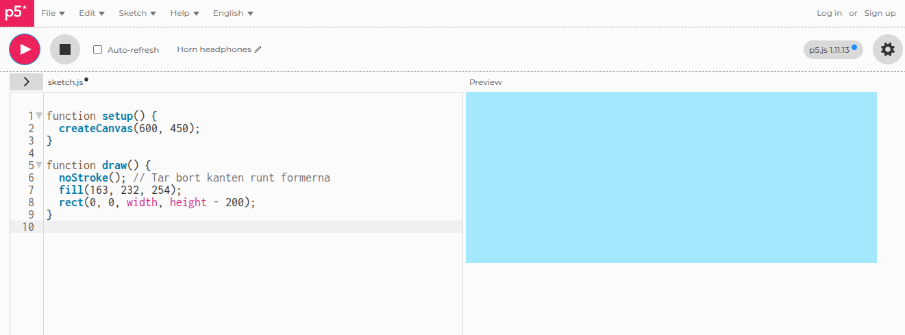

**Innehåll:** [Bakgrund](#bakgrund) &bull;
[Ninjan](#ninjan) &bull;
[Hoppa](#hoppa) &bull;
[Hinder](#hinder) &bull;
[Poängräkning](#poängräkning) &bull;
[Game Over](#game-over) &bull;
[Uppgifter](#uppgifter) &bull;
[Källor](#källor)

# Infinite Runner ⭐⭐


Ett spel av typen Infinite/Endless Runner tar aldrig slut. Målet är att överleva så långt som möjligt och ju längre, desto högre poäng får du.

## Jobba så här
Vägen till ett färdigt projekt är en pusselbit i taget 🧩. Gör därför ett avsnitt i taget uppifrån och ner.
- Få det att fungera innan ni går vidare till nästa avsnitt. 
- Testkör ofta, efter varje avsnitt eller ännu oftare.

Var det något i beskrivningen som var svårt att förstå? Ta med det i redovisningen. 📝

## Nytt projekt
Gå till https://editor.p5.js och ta bort exempelkoden.

# Bakgrund
## Första steget
Precis som i [Gem Catcher](https://github.com/coderdojolund/gunnesbo26/blob/main/Gem-Catcher/gem-catcher.md) börjar vi koda vårt spel genom att sätta grafikfönstrets bredd och höjd.

```javascript
function setup() {
    createCanvas(600, 450);
}
```

✏️ Testkör!
>Funktionen `setup()` förbereder spelet. Den körs en gång i början. Variabler som behövs i `draw()` ska komma före `setup()`.

## Rita
Vi kan rita figurer med olika funktioner. Innan vi ritar en form måste vi tala om vilken färg den ska ha med `fill()`. Här är några vanliga funktioner:
- `line()`
- `circle()`
- `rect()`
- `ellipse()`
- `triangle()`

För att lära dig mer kan du läsa i [dokumentationen för p5.js](https://p5js.org/reference/).

Vi ska börja med `rect()`. Den ritar en rektangel på skärmen. Vi lägger till koden i funktionen `draw()`.

✏️ Uppdatera koden så att den blir så här:

```javascript
function setup() {
  createCanvas(600, 450);
}

function draw() {
  noStroke(); // Tar bort kanten runt formerna
  fill(163, 232, 254);
  rect(0, 0, width, height - 200);
}
```

Det här gör de nya raderna:

- `function draw() { ... }`: Detta är en funktion som p5.js kör automatiskt cirka 60 gånger i sekunden. Allt som ska visas på skärmen skrivs här. Detta brukar man kalla FPS-loopen. Om den koden är för långsam kommer spelet att lagga.
- `fill(163, 232, 254)`: Detta sätter färgen för de former som ritas efteråt. Det är en blandning av 163 delar röd, 232 grön och 254 blå.
- `rect(0, 0, width, height - 200)`: Detta ritar en rektangel. De två första siffrorna är koordinaterna för det övre vänstra hörnet (0, 0). `width` är ritytans totala bredd (600). Den sista delen sätter höjden till ritytans höjd minus 200 pixlar.

✏️ **Testa att experimentera med olika färger och se vad du får. Kom ihåg att varje färgkomponent ska vara mellan 0 och 255.**

Så här ser det ut när jag testar:



## Marken
Steget innan ritade himlen. Vi lägger till en andra rektangel för att rita marken.

```javascript
function setup() {
  createCanvas(600, 450);
}

function draw() {
  noStroke();
  
  // Himlen
  fill(163, 232, 254);
  rect(0, 0, width, height - 200);
  
  // Marken
  fill(88, 242, 152);
  rect(0, height - 200, width, 200);
}
```
Det här gör den nya raden:

- `rect(0, height - 200, width, 200)`: Den här rektangeln börjar där himlen slutar. Y-koordinaten är `height - 200`. Den är lika bred som hela ritytan och är 200 pixlar hög.

✏️ Mata in detta och kör din kod. Din skärm kan se ut så här:


# Ninjan

## Animering
Vi gör en enkel animering genom att byta mellan två olika emoji. 
Jämför med din kod och lägg till det nya.
- Du behöver inte lägga till förklaringarna som börjar med `//`
- Variabeln `groundY` använder vi för att slippa skriva `height - 200` så många gånger. Den gör det lättare att ändra hur mycket plats marken tar i spelgrafiken.

```javascript
let groundY;

// Ninja-variabler
let runnerX = 100;
let runnerY;
let emojiSize = 80;

// NYTT: Lista med emojis för animeringen
let runEmojis = ["🏃", "💨"]; 

function setup() {
  createCanvas(600, 450);
  groundY = height - 200;
  runnerY = groundY; 
  
  textSize(emojiSize);
  textAlign(CENTER, CENTER);
}

function draw() {
  noStroke();
  
  // Himlen
  fill(163, 232, 254);
  rect(0, 0, width, groundY);
  
  // Marken
  fill(88, 242, 152);
  rect(0, groundY, width, 200);
  
  // --- NYTT: Animeringslogik ---
  
  // Vi ritar figuren på skärmen.
  // Vi använder frameCount för att räkna ut vilken emoji som ska visas.
  
  // frameCount ökar med 1 för varje bildruta (ca 60 gånger per sekund).
  // Genom att dividera med 10 och avrunda nedåt (floor) byter vi emoji långsammare.
  let frameIndex = floor(frameCount / 10); 
  
  // % (modulo) ser till att indexet växlar mellan 0 och 1 (längden på listan).
  let currentEmojiIndex = frameIndex % runEmojis.length;
  
  // Hämta den aktuella emojin från listan
  let currentEmoji = runEmojis[currentEmojiIndex];
  
  // Rita den aktuella emojin
  text(currentEmoji, runnerX, runnerY);
}
```

✏️ Testkör!

### Vill du använda egna bilder?

* Leta upp andra emoji som du vill använda. Du kan använda fler än två. Då behöver animeringslogiken ändras lite.

### Justera placeringen

Du kan justera ninjans placering med `runnerX` och `runnerY`.

✏️ Pröva detta:

```javascript
runnerX = 100
runnerY = height - 200
```
✏️ **Pröva att justera ninjans position genom att ändra `runnerX` och `runnerY` tills hen är där du vill.**

# Hoppa

## Fysik

Vilken av de här ser mest verklig ut?


I verkliga livet påverkas föremål av gravitationen. För att få vår ninja att hoppa realistiskt, behöver vi simulera gravitationens effekter i vårt spel.

✏️ Vi börjar med att lägga till variabler för `velocityY` och `gravity`, alltså hastigheten i y-led och gravitationen.

```javascript
// lägg till som nya ninja-variabler
let velocityY = 0;
let gravity = 1;
```

Förklaring av kodraderna:
- `velocityY = 0` : Håller reda på hur snabbt ninjan ska röra sig uppåt eller neråt. Hastigheten börjar med 0 eftersom ninjan inte hoppar än.
- `gravity = 1` : Gravitationen påverkar hastigheten. Vi kan ändra detta senare och se effekten av det, men just nu låter vi värdet vara 1. Enheten är pixlar per tid i kvadrat. 

✏️ I `keyPressed()` ska vi sen ändra hastigheten när uppåtpilen trycks ner.

```javascript
function keyPressed() {
  if (keyCode === UP_ARROW) {
    velocityY = -15;
  }
}
```

Sista steget är koden i `draw()`. Lägg till en rad som justerar ninjans position, `runnerY`. Så här kan det set ut:

```javascript
function draw() {
  noStroke();
  
  // Himlen
  fill(163, 232, 254);
  rect(0, 0, width, groundY);
  
  // Marken
  fill(88, 242, 152);
  rect(0, groundY, width, 200);

  runnerY += velocityY; // nytt
  // resten som innan
```

Det här gör raderna:

- `velocityY = -15` : Sätt hastigheten upp/ner till &ndash;15. Ett negativt värde betyder att den rör sig uppåt.
- `runnerY += velocityY` :  Ändra vår ninjas position baserat på hastigheten. Symbolen `+=` betyder att vi ökar `runnerY` med värdet i `velocityY`.

✏️ Testa det! Om du programmerat rätt, bör ninjan flyga upp i himlen när du trycker uppåtpil. Det är för att vi inte har lagt till någon gravitation än!
>**Funkar inte uppåtpil? Kom ihåg att klicka i spelfönstret när du startat spelet med *Run*.**

## Gravitation
Gravitationen ändrar ninjans hastighet. 

✏️ Under raden `runnerY += velocityY` lägger vi till gravitionen med `velocityY += gravity`.

Nu ramlar vår ninja rakt ner! Vi har inte talat om för ninjan när den ska sluta falla! Vi lägger till det nu:

```javascript
  runnerY += velocityY;
  velocityY += gravity;
  
  if (runnerY > groundY) {
    velocityY = 0; // sluta fall
    runnerY = groundY; // stanna på marken
  } 
```
Här bestämmer vi att `height - 200` (`groundY`) är där marken börjar och om ninjan är på en y-koordinat som är större än `groundY` så sätter vi hens `velocityY` till 0 och y-koordinaten till `groundY`. Detta hindrar att hen faller igenom marken.

✏️ Testkör!

Ditt program kan nu se ut så här:
```javascript
let groundY;

// Ninja-variabler
let runnerX = 100;
let runnerY;
let emojiSize = 80;
let velocityY = 0;
let gravity = 1;

// NYTT: Lista med emojis för animeringen
let runEmojis = ["🏃", "💨"]; 

function setup() {
  createCanvas(600, 450);
  groundY = height - 200;
  runnerY = groundY; 
  
  textSize(emojiSize);
  textAlign(CENTER, CENTER);
}

function keyPressed() {
  if (keyCode === UP_ARROW) {
    velocityY = -15;
  }
}

function draw() {
  noStroke();
  
  // Himlen
  fill(163, 232, 254);
  rect(0, 0, width, groundY);
  
  // Marken
  fill(88, 242, 152);
  rect(0, groundY, width, 200);

  runnerY += velocityY;
  velocityY += gravity;
  
  if (runnerY > groundY) {
    velocityY = 0; // sluta fall
    runnerY = groundY; // stanna på marken
  } 
  
  // --- NYTT: Animeringslogik ---
  
  // Vi ritar figuren på skärmen.
  // Vi använder frameCount för att räkna ut vilken emoji som ska visas.
  
  // frameCount ökar med 1 för varje bildruta (ca 60 gånger per sekund).
  // Genom att dividera med 10 och avrunda nedåt (floor) byter vi emoji långsammare.
  let frameIndex = floor(frameCount / 10); 
  
  // % (modulo) ser till att indexet växlar mellan 0 och 1 (längden på listan).
  let currentEmojiIndex = frameIndex % runEmojis.length;
  
  // Hämta den aktuella emojin från listan
  let currentEmoji = runEmojis[currentEmojiIndex];
  
  // Rita den aktuella emojin
  text(currentEmoji, runnerX, runnerY);
}
```

# Hinder
## En lista med figurer

I vårt [Gem Catcher-spel](https://github.com/coderdojolund/gunnesbo26/blob/main/Gem-Catcher/gem-catcher.md) har vi bara en ädelsten i taget och den flyttar sig till toppen av skärmen varje gång vi fångar den.
I ninjaspelet kommer vi att flera hinder på skärmen samtidigt.


För att klara det behöver vi listor (arrays). Då kan vi ha många hinder utan att varje hinder måste ha en egen variabel.

✏️ Först skapar vi en tom lista som heter `obstacles` och en variabel `obstaclesTimeout`. Lägg till detta någonstans bland de andra variablerna i början av koden.

```javascript
let obstacles = [];
let obstaclesTimeout = 0;
```

✏️ I vår draw()-funktion ska vi öka `obstaclesTimeout` med 1 för varje bildruta.

```javascript
obstaclesTimeout += 1;
```

✏️ Om `obstaclesTimeout` är större än 50 lägger vi till ett nytt hinder-objekt i listan och nollställer räknaren. Det blir alltså ett nytt hinder var femtionde bildruta.

```javascript
if (obstaclesTimeout > 50) {
  let obstacle = {
    x: width + 50,
    y: height - 200
  };
  obstacles.push(obstacle);
  obstaclesTimeout = 0;
}
```

Här skapar vi ett objekt med `{}` som innehåller koordinaterna för hindret. `obstacles.push(obstacle)` lägger till hindret i listan `obstacles`.

✏️ För att få hindren att röra sig över skärmen lägger vi detta i `update()`.

```javascript
for (let obs of obstacles) {
  obs.x -= 8;
}
```

Detta går igenom hela listan `obstacles` och minskar x-koordinaten för varje objekt `obs`. Det gör att hindret rör sig åt vänster.

✏️ Till slut ritar vi hindren på skärmen. Vi kan göra det i samma `for`-slinga. Vi ska ju ändå gå igenom alla hindren. Uppdatera koden så att den blir så här:

```javascript
for (let obs of obstacles) {
  obs.x -= 8;
  textSize(40);
  text('🌵', obs.x, obs.y);
}
```

✏️ Testkör din kod!

Nu kan ditt program se ut ungefär så här:

```javascript
let groundY;

// Ninja-variabler
let runnerX = 100;
let runnerY;
let emojiSize = 80;
let velocityY = 0;
let gravity = 1;

let runEmojis = ["🏃", "💨"]; 

let obstacles = [];
let obstaclesTimeout = 0;

function setup() {
  createCanvas(600, 450);
  groundY = height - 200;
  runnerY = groundY; 
  
  textSize(emojiSize);
  textAlign(CENTER, CENTER);
}

function keyPressed() {
  if (keyCode === UP_ARROW) {
    velocityY = -15;
  }
}

function draw() {
  noStroke();
   
  // Himlen
  fill(163, 232, 254);
  rect(0, 0, width, groundY);
  
  // Marken
  fill(88, 242, 152);
  rect(0, groundY, width, 200);
  obstaclesTimeout += 1;
  if (obstaclesTimeout > 50) {
    let obstacle = {
      x: width + 50,
      y: height - 200
    };
    obstacles.push(obstacle);
    obstaclesTimeout = 0;
  }

  for (let obs of obstacles) {
    obs.x -= 8;
    textSize(40);
    text('🌵', obs.x, obs.y);
  }
  
  runnerY += velocityY;
  velocityY += gravity;
  
  if (runnerY > groundY) {
    velocityY = 0; // sluta falla
    runnerY = groundY; // stanna på marken
  } 
  
  // Animeringslogik ---
  // Vi ritar figuren på skärmen.
  // Vi använder frameCount för att räkna ut vilken emoji som ska visas.
  
  // frameCount ökar med 1 för varje bildruta (ca 60 gånger per sekund).
  // Genom att dividera med 10 och avrunda nedåt (floor) byter vi emoji långsammare.
  let frameIndex = floor(frameCount / 10); 
  
  // % (modulo) ser till att indexet växlar mellan 0 och 1 (längden på listan).
  let currentEmojiIndex = frameIndex % runEmojis.length;
  
  // Hämta den aktuella emojin från listan
  let currentEmoji = runEmojis[currentEmojiIndex];
  
  // Rita den aktuella emojin
  text(currentEmoji, runnerX, runnerY);
}
```

# Poängräkning

## Poängen

Precis som i [Gem Catcher](https://github.com/coderdojolund/gunnesbo26/blob/main/Gem-Catcher/gem-catcher.md), använder vi en variabel `score` för att hålla reda på  poängställningen.

✏️ Skapa poäng-variabeln. Lägg till den högst upp i din kod, där du har dina andra variabler:

```javascript
let score = 0;
```

✏️ Öka poängen när hinder passeras. Vi vill öka poängen varje gång ett hinder försvinner ut åt vänster. För att kunna ta bort saker ur en lista på ett bra sätt i JavaScript använder vi en for-loop som räknar nedåt.

Hitta stället i `draw()` där du flyttar hindren `(obs.x -= 8)` och uppdatera den så här:

```javascript
// Gå igenom listan baklänges för att kunna ta bort hinder
  for (let i = obstacles.length - 1; i >= 0; i--) {
    let obs = obstacles[i];
    obs.x -= 8; // Flytta hindret

    // Om hindret lämnar skärmen (-50)
    if (obs.x < -50) {
      obstacles.splice(i, 1); // Ta bort hindret ur listan
      score += 1;             // Ge poäng
    }
  }
```
Detta är vad raderna betyder:
- `obstacles.length - 1`: Vi börjar titta på det sista hindret i listan.
- `obstacles.splice(i, 1)`: Detta tar bort exakt 1 sak vid position i. Det är JavaScripts sätt att göra remove().
- `score += 1`: Ökar poängen med 1.


✏️ Testkör!

## Skriv ut poängen
För att vi ska se hur bra(?) det går ska vi skriva ut poängen i spelfönstret.

✏️ Skriv ut poängen. Lägg till detta längst ner i draw()-funktionen:
```javascript
// Skriv ut poängen
  fill(0); // Svart färg
  textSize(30);
  textAlign(LEFT, TOP); // Gör så att texten börjar uppe till vänster
  text("Score: " + score, 20, 20);
  
  // Återställ textinställningar för ninjan
  textAlign(CENTER, CENTER);
  textSize(emojiSize);
```

### Varför ändrar vi `textAlign`?
I början av koden satte vi `textAlign(CENTER, CENTER)` för att ninjan skulle ritas snyggt.
Om vi inte ändrar tillbaka till LEFT för poängen, kommer texten "Score" att hamna halvvägs utanför skärmen.

✏️ Testkör!

Nu ska du få poäng varje gång du hoppar över en kaktus och den försvinner ut till vänster. 🌵✨

>Utmaning: Kan du ändra färgen på poängtexten så den syns bättre mot himlen? Testa att ändra siffrorna i `fill()`.


# Game Over
Just nu händer ingenting när ninjan krockar med en kaktus.
Vi behöver ett sätt att avsluta spelet. 
Vi ska använda en variabel som håller reda på om spelet pågår eller är slut.

✏️ Först lägger vi till en variabel `gameOver` och sätter den till `False` i början. Lägg till den högst upp bland de andra variablerna.

```javascript
let gameOver = false;
```

Hur upptäcker vi krockar? Vi måste kontrollera om avståndet mellan ninjan och kaktusen är för litet. I p5.js använder vi funktionen `dist()`.

✏️ Hitta loopen i `draw()` där du flyttar hindren. Lägg till kollen för krock:

```javascript
for (let i = obstacles.length - 1; i >= 0; i--) {
    let obs = obstacles[i];
    obs.x -= 8;

    // Kolla krock: Är avståndet mindre än 40 pixlar?
    if (dist(runnerX, runnerY, obs.x, obs.y) < 40) {
      gameOver = true;
    }

    if (obs.x < -50) {
      obstacles.splice(i, 1);
      score += 1;
    }
  }
```

✏️ Visa Game Over-skärmen. Vi ändrar i `draw()` så att spelet visar en text istället för ninjan om `gameOver` är sant.

Sök upp slutet av din `draw()`-funktion och ändra den så här:

```javascript
if (gameOver) {
    fill(255, 0, 0); // Röd färg
    textSize(60);
    textAlign(CENTER, CENTER);
    text("GAME OVER", width / 2, height / 2 - 50);
    text("Poäng: " + score, width / 2, height / 2 + 50);
    noLoop(); // Stoppar spelet helt
  } else {
    // Här ritas ninjan (din befintliga animeringskod)
    let frameIndex = floor(frameCount / 10);
    let currentEmojiIndex = frameIndex % runEmojis.length;
    let currentEmoji = runEmojis[currentEmojiIndex];
    text(currentEmoji, runnerX, runnerY);
  }
```

✏️ Uppdatera och testkör!

Så här kan det se ut:


Ditt spel kan se ut så här till slut:

```javascript
let groundY;
let runnerX = 100;
let runnerY;
let emojiSize = 80;
let velocityY = 0;
let gravity = 1;

let runEmojis = ["🏃", "💨"];
let obstacles = [];
let obstaclesTimeout = 0;

let score = 0;
let gameOver = false;

function setup() {
  createCanvas(600, 450);
  groundY = height - 200;
  runnerY = groundY;
  
  textSize(emojiSize);
  textAlign(CENTER, CENTER);
}

function keyPressed() {
  if (keyCode === UP_ARROW) {
    velocityY = -15;
  }
}

function draw() {
  background(163, 232, 254); // Himlen
  
  // Marken
  noStroke();
  fill(88, 242, 152);
  rect(0, groundY, width, 200);

  if (gameOver) {
    fill(0);
    textSize(60);
    textAlign(CENTER, CENTER);
    text("GAME OVER", width / 2, height / 2 - 50);
    textSize(40);
    text("Score: " + score, width / 2, height / 2 + 30);
    return; // Avslutar funktionen här om spelet är slut
  }

  // Skapa hinder
  obstaclesTimeout += 1;
  if (obstaclesTimeout > 50) {
    obstacles.push({ x: width + 50, y: height - 200 });
    obstaclesTimeout = 0;
  }

  // Hantera hinder
  for (let i = obstacles.length - 1; i >= 0; i--) {
    let obs = obstacles[i];
    obs.x -= 8;

    // Kolla krock
    if (dist(runnerX, runnerY, obs.x, obs.y) < 40) {
      gameOver = true;
    }

    // Ta bort hinder och ge poäng
    if (obs.x < -50) {
      obstacles.splice(i, 1);
      score += 1;
    }

    textSize(40);
    text('🌵', obs.x, obs.y);
  }

  // Fysik för ninjan
  runnerY += velocityY;
  velocityY += gravity;
  if (runnerY > groundY) {
    velocityY = 0;
    runnerY = groundY;
  }

  // Rita poäng
  fill(0);
  textSize(30);
  textAlign(LEFT, TOP);
  text("Score: " + score, 20, 20);

  // Animera och rita ninjan
  textAlign(CENTER, CENTER);
  textSize(emojiSize);
  let frameIndex = floor(frameCount / 10);
  let currentEmoji = runEmojis[frameIndex % runEmojis.length];
  text(currentEmoji, runnerX, runnerY);
}
```

# Uppgifter

Det är vanligt att program har buggar. Det finns ett par buggar i vårt ninjaspel. Har du hittat några än? Pröva att rätta dem! Redovisa hur du gjorde.

## Uppgift 1: Buggfix. Multihopp
Pröva att snabbt trycka på hoppknappen flera gånger. Hoppade din ninja upp ovanför det som syns på skärmen? Ninjan ska bara kunna hoppa när hen är på marken och inte i luften. Kan du fixa det?

## Uppgift 2: Utvärdera ert eget arbete!
När ni svarar på detta, tänk på att *ni har tillgång till uppgiften* &ndash; ni behöver alltså inte kunna koden utantill.

**2A.** De här delarna av uppgiften har vi gjort. Vi förstår dem och kan förklara koden för Susanne eller inför klassen.

**2B.** De här delarna av uppgiften har vi gjort *men vi förstår dem inte till 100%*. Ge exempel på något ni inte förstår.

## Uppgift 3
Välj och gör minst en av utmaningarna här nedanför. Redovisa så här:
- Beskriv kort vad förändringen är och hur den ska fungera.
- Beskriv hur du fick ändra koden för att göra ändringen.
- Om det inte gick att genomföra, förklara med några meningar vad du försökte och vad som hände. Glöm inte kodexempel. 

## Utmaning 1: Olika hinder
Just nu finns bara kaktusar. Kan du göra så att spelet väljer slumpmässigt mellan olika emoji?

>Ledtråd: Skapa en lista med hinder: `let emojiList = ["🌵", "🔥", "💣"];` Använd funktionen `random(emojiList)` när du skapar ett nytt hinder-objekt

## Utmaning 2: Öka svårighetsgraden
Spelet är ganska enkelt nu. Kan du få det att gå snabbare ju mer poäng du får?

Ledtråd: Ersätt siffran `8` i `obs.x -= 8` med en variabel, till exempel `speed`. Öka speed lite varje gång `score` går upp.


### Utmaning 3. Sprid ut hindren
Som spelet är nu dyker hindren alltid upp på samma avstånd från varann. Kan du slumpa till det så att hindren ibland är närmare och ibland längre från varann?

> Ledtråd: läs på om funkionen `random()`

# Källor
Detta är en översättning och anpassning till p5.js av originalet på [Trinket.io](https://aposteriori.trinket.io/game-development-with-pygame-zero#/ninja-runner/infinite-runner).
