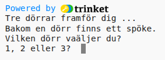
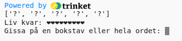
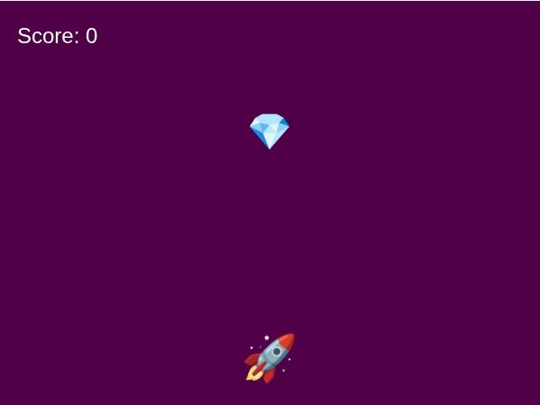
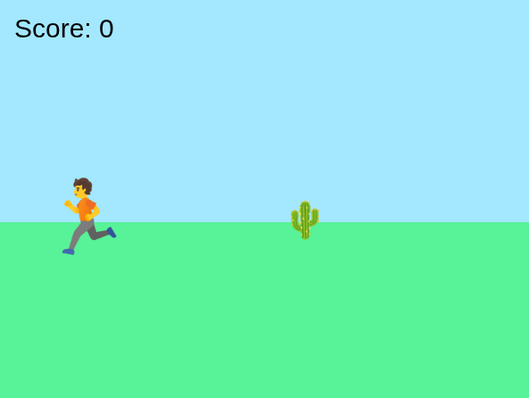

# Välkommen till spelprogrammeringen 🎨

Vi kodar spel i Python och JavaScript. Spelen är översatta från engelska och fungerar i [trinket med Python 3](https://trinket.io/python3) respektive [Processing, p5](https://editor.p5js.org/).

* **Lätta uppgifter att börja med:** Spökhuset: *se Google Classroom* &bull; Nio liv: *se Google Classroom*. Detta är textspel i Python.
* **Spel och animering i JavaScript:**
  [Eyes](#eyes-)
  &bull; [Flowers](#flowers-)
  &bull; [Gem Catcher](#gem-catcher-)
  &bull; [Ninja Runner](#ninja-runner-)
  &bull; [Snake](#snake-)
* **Klura som en ingenjör:** [Eyes](#eyes-) &bull; [Hur många dagar fyller du?](#hur-många-dagar-fyller-du-) Vi löser problem ett steg i taget.
* **Tips:** [Var hittar jag specialtecken på tangentbordet? { @ } [ _ ]  ](#var-hittar-jag-symbolerna-på-tangentbordet)
  &bull; [Python och Javascript är olika](#python-och-javascript-%C3%A4r-olika)

### Gradering
⭐: lättare uppgift &ndash; du ska göra minst en av dessa och får göra alla om du vill 
⭐⭐: lite svårare uppgift 
⭐⭐⭐: de svåraste uppgifterna, oftast för att koden blir längre

### Gör så här
Uppgifterna är bara en början &ndash; gör egna förbättringar och tillägg.
- Be dina klasskamrater att testköra och ge konstruktiv feedback på spelet *och* koden. 
- Skriv ner vilka kommentarer du fick och om du gjorde några ändringar baserat på kommentarerna.
- Mata in koden för hand. Kopiera bara när instruktionen säger så.

## Spökhuset ⭐ och  Nio liv ⭐

Textspel i Python kodar ni i [trinket](https://trinket.io/python3).
>👉 Det behöver vara Python 3, https://trinket.io/python3, för att det ska fungera med svenska namn som `poäng`.

Det går också bra att använda Google Colab: https://colab.research.google.com/

Instruktionerna för Spökhuset och Nio liv finns i Google Classroom.

## Eyes ⭐⭐

https://github.com/coderdojolund/gunnesbo26/blob/main/Eyes/eyes.md

## Gem Catcher ⭐⭐

https://github.com/coderdojolund/gunnesbo26/blob/main/Gem-Catcher/gem-catcher.md

## Ninja Runner ⭐⭐

https://github.com/coderdojolund/gunnesbo26/blob/main/Ninja-Runner/ninja-runner.md

## Snake ⭐⭐⭐

https://github.com/coderdojolund/gunnesbo26/blob/main/Snake/snake.md

## Hur många dagar fyller du? ⭐⭐⭐

Detta är ett textbaserat Pythonprojekt som du kodar i [trinket.io](https://trinket.io/) eller Google Colab: https://colab.research.google.com/

https://github.com/coderdojolund/gunnesbo26/blob/main/Dagar/dagar.md

# Var hittar jag symbolerna på tangentbordet?

| Symbol | Tangent på Chromebook, svenskt tangentbord |
| ------------- | ------------- |
| { *vänster måsvinge* | `alt gr` + `7` &ndash; håll ner `alt gr` medan du trycker 7 |
| } *höger måsvinge* | `alt gr` + `0` |
| [ *vänsterklammer* | `alt gr` + `8` |
| ] *högerklammer* | `alt gr` + `9` |
| @ | `alt gr` + `2` |
| _ *understreck* | `⬆️` + `–` &ndash; håll ner skifttangenten medan du trycker `-` |
 
# Python och JavaScript är olika

<table>
  <thead>
    <tr>
      <th>Vad?</th>
      <th>Python</th>
      <th>JavaScript</th>
    </tr>
  </thead>
  <tbody>
    <tr>
      <td>Skapa en variabel</td>
      <td><pre><code>poäng = 20</code></pre></td>
      <td><pre><code>let poäng = 20;</code></pre></td>
    </tr>
    <tr>
      <td>Skapa en funktion</td>
      <td><pre><code>
def moms(pris):
    return pris*1.25
👆👆tänk på mellanslagen
</code></pre></td>
<td><pre><code>
function moms(pris) {
  return pris*1.25;
}
👆tänk på måsvingarna { och }
</code></pre></td>
</tr>
</tbody>
</table>

# Källor
- Projektet från 2023 finns [här](https://github.com/coderdojolund/gunnesbo8). Det använde repl.it.

# OM VI HINNER!

## Blocks ⭐⭐⭐
Kommer senare!

)

https://github.com/coderdojolund/gunnesbo26/blob/main/Blocks/blocks.md

## Fifteen ⭐⭐⭐

Kommer senare!

)

https://github.com/coderdojolund/gunnesbo26/blob/main/Fifteen/fifteen.md

## Flowers ⭐⭐⭐

Kommer senare!

https://github.com/coderdojolund/gunnesbo26/blob/main/Flowers/flowers.md

## Life ⭐⭐⭐
Kommer senare!

 

https://github.com/coderdojolund/gunnesbo26/blob/main/Life/life.md

## Repeat ⭐⭐⭐
Kommer senare!

https://github.com/coderdojolund/gunnesbo26/blob/main/Repeat/repeat.md

## Sokoban ⭐⭐⭐
Kommer senare!

https://github.com/coderdojolund/gunnesbo26/blob/main/Sokoban/sokoban.md
